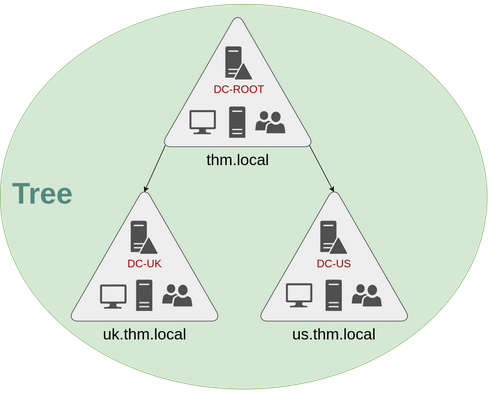
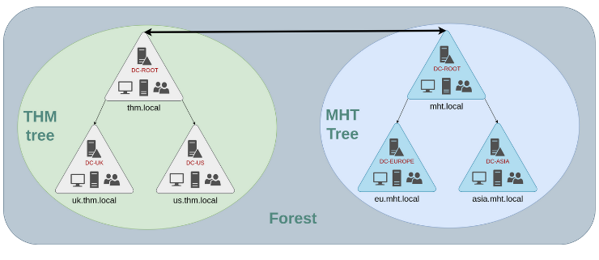

## *Windows Domain*
- Group of users and computers under the administration of a given business.
- Centralize the administration of common components of a Windows computer network in a single repository called Active Directory (AD), the server that runs AD services is known as a Domain Controller (DC).
- Main advantages of a Windows domain
	- Centralized identity management.
	- Managing security policies, configure security policies from AD and apply them to users and computers across the network as needed.
- Core of any Windows Domain is Active Directory Domain Service (AD DS), this service acts as a catalog that holds the information of all of the objects that exist on your network.
- #### Objects
	- **Users**
		- One of the most common object types, known as `Security Principals`, meaning they can be authenticated by the domain and can be assigned privileges over `resources` like files or printers.
		- Security Principals is an object that can act upon resources in the network.
		- Users can be used to represent two types of entities
			- **People**, represents persons like employees.
			- **Services**, like IIS and MSSQL. Every single service requires a user to run, but service users are only given the privileges needed to run their specific service.
	- **Machines**
		- For every computer that joins the domain, a machine object will be created.
		- Also considered `Security Principals` and are assigned an account like a regular user, but this account has somewhat limited rights within the domain itself.
		- The machine accounts are local administrators on the assigned computer.
		- Machine accounts follow a naming scheme `<COMPUTER_NAME>$`, like `DC01$`.
	- **Security Groups**
		- Helps in assigning access rights to files or other resources to multiple users.
		- Also considered `Security Principals`, and therefore can have privileges over resources on the network.
		- Groups can have both users and machines as members or even other groups.
		- Most important groups are `Domain Admins`, `Server Operators`, `Backup Operators`, `Account Operators`, `Domain Users`, `Domain Computers`, and `Domain Controllers`.
	- **Organizational Units (OUs)**
		- Container objects that allow you to classify users and machines.
		- Mainly used to define sets of users with similar policing requirements, for example, Sales Department OU and IT Department OU.
		- OUs are protected against accidental deletion, to delete an OU, enable the Advanced Features in the View menu, then `right-click OU > Properties > Object > uncheck 'Protect object from accidental deletion'`.
		- Segregate Workstations, Servers, and Domain Controllers to their OUs, or create new OUs for specific purposes.
	- **Security Groups vs OUs**
		- Both are used to classify users and computers.
		- OUs are handy for applying policies to users and computers, which include specific configurations that are related to sets of users depending on their role in the enterprise.
		- A user can only be a member of a single OU at a time.
		- Security Groups are used to grant permissions over resources, for example, access to a shared folder, network printer.
		- A user can be a member of many groups.
- #### *Delegation*
	- Give specific users some control over some OUs to perform advanced tasks without needing a Domain Administrator.
	- For example, giving IT Support the privileges to reset other low-privilege user's passwords `Set-ADAccountPassword <username> -Reset -NewPassword (Read-Host -AsSecureString -Prompt 'New Password') -Verbose` and force the reset to be on logon using `Set-ADUser -ChangePasswordAtLogon $true -Identity <username> -Verbose`.
- #### *Group Policies*
	- Assign different policies to each OU, to push different configurations and security baselines to users depending on their department.
	- Windows manages such policies through `Group Policy Objects` (GPO).
	- GPOs are simply a collection of settings that can be applied to OUs. Can contain policies aimed at either users or computers, allowing you to set a baseline on specific machines and identities.
	- Configure GPOs through `Group Policy Management` tool.
		- First, create a GPO under `Group Policy Objects` and then link it to the OU of choosing.
		- Note that the GPO will be linked to the OU and its sub-OUs under it.
		- You can also apply Security Filtering to GPOs so that they are only applied to specific users/computers under an OU, by default, they will be applied to the `Authenticated Users` group which includes all users/PCs.
	- **GPO Distribution**
		- GPOs are distributed to the network via a network share called `SYSVOL`, which is stored in the DC. All users should have access to this share for syncing.
		- The `SYSVOL` share points by default to `C:\Windows\SYSVOL\sysvol\` directory on each of the DCs in the network.
		- Once a change is made to any GPO, it might take up to 2 hours for computers to catch up. You can always force sync using `gpupdate /force` on the computer.
- #### *Authentication Methods*
	- All credentials hashes are stored in the DCs, whenever a user tries to authenticate to a service using domain credentials, the service needs to ask the DC to verify.
	- **Kerberos**
		- Used by any recent version of Windows, default protocol in any recent domains.
		- Users who log into a service will be assigned tickets. Users with tickets can present them to a service to demonstrate they have already authenticated into the network before.
		- **Authentication Process**
			- The user sends their username and a timestamp encrypted using a key derived from their password to the `Key Distribution Center (KDC)`.
				- KDC is a service installed on the DC in charge of creating `Kerberos` tickets on the network.
				- The KDC will create and send back a `Ticket Granting Ticket (TGT)`, which will allow the user to request additional tickets to access specific services, and a `Session Key` which is used to generate the following requests.
				- The TGT is encrypted using the `krbtgt` account's password hash, the encrypted TGT contains a copy of the `Session Key` as part of its contents and the KDC doesn't need to store the Session Key as it can decrypt the TGT.
			- When a user wants to connect to a service like a share, website or database, they will use their TGT to ask the KDC for a `Ticket Granting Service (TGS)`.
				- TGS are tickets that allow access on the service it was created for.
				- To request a TGS, the user sends their username and a timestamp encrypted using the Session Key, along with the TGT and a `Service Principle Name (SPN)`which indicates the service and server name we intend to access.
				- As a result the KDC will send a TGS along with a `Service Session Key`; which is used to authenticate to the service requested, back to the user.
				- The TGS is encrypted using a key derived from the `Service Owner Hash`, the Service Owner is the user or machine account that the service runs under.
				- The TGS contains a copy of the `Service Session Key` on its content so that the Service Owner can access it by decrypting the TGS.
			- The TGS can then be sent to the desired service to authenticate and establish a connection.
				- The service will use its configured account's password hash to decrypt the TGS and validate the Service Session Key.
	- **NetNTLM**
		- Legacy authentication protocol kept for compatibility purposes.
		- Works using challenge-response mechanism.
		- **Authentication Process**
			- Client sends an authentication request to the server they want to access.
			- The server generates a random number and sends it as a challenge to the client.
			- The client combines their NTLM password hash with the challenge (and other known data) to generate a response to the challenge and sends it back to the server for verification.
			- The server forwards the challenge and the response to the DC for verification.
			- The DC uses the challenge to recalculate the response and compares it to the original response sent by the client. If they both match, the client is authenticated; otherwise, access is denied. The authentication result is sent back to the server.
			- The server forwards the authentication result to the client.
		- The user's password (or hash) is never transmitted through the network for security.
		- The previous process is for domain accounts, if a local account is used, the server can verify the response to the challenge itself without requiring interaction with the DC since it has the password hash stored locally on its SAM.
- #### *Trees*
	- In case of multiple domains that require to be managed independently, if they share the same namespace, they can be joined into a Tree.
	- 
	- UK will have their own DC that manages UK resources only, and US will have theirs.
	- Policies can also be configured independently for each domain in the tree.
	- A new Security Group is introduced for Trees and Forests,  `Enterprise Admins` group will grant a user administrative privileges over all of an enterprise's domains, each domain still have its Domain Admins.
- #### *Forests*
	- Domains managed that are configured in different namespaces.
	- 
	- The union of several trees with different namespaces into the same network is known as a forest.
- #### *Trust Relationships*
	- Having multiple domains organised in Trees or Forests allows for a nice compartmentalization, but at certain point, a user in one domain in a Tree might need to access a shared file in the other another domain in another Tree.
	- For this to happen, domains arranged in trees and forests are joined together by `Trust Relationships`.
	- The simplest trust relationship that can be established is a `one-way trust relationship`.
		- Domain A trusts domain B, so domain B user can be authorized to access resources on domain A.
	- Two-way trust relationship can also be made allowing both domains to authorize users access to the other domain's resources.
