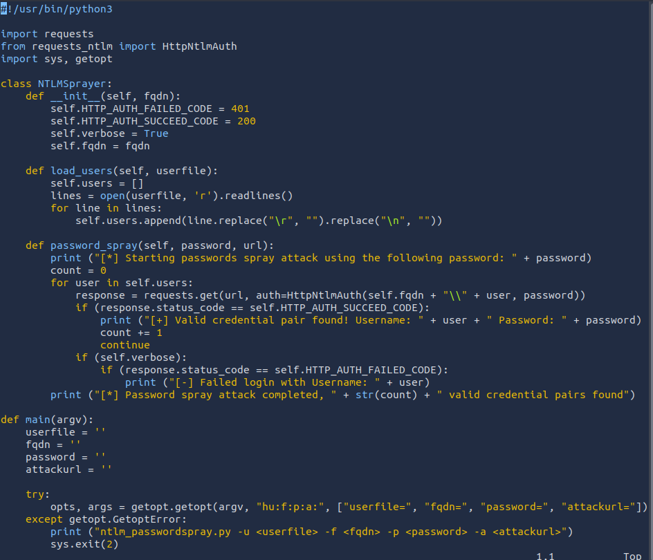
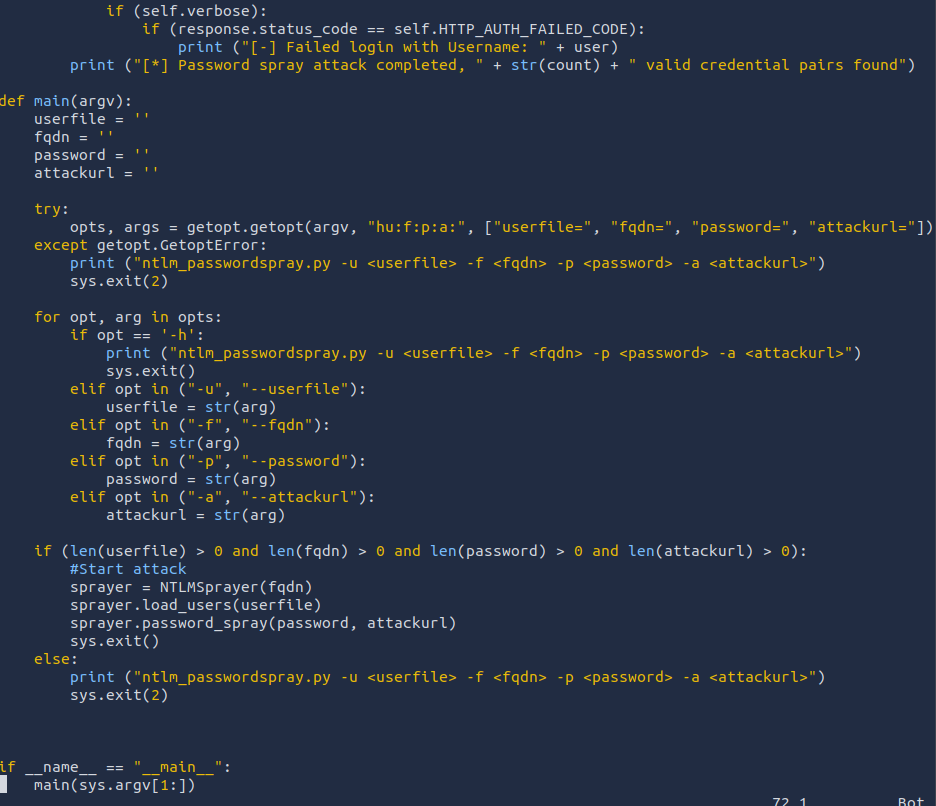

## *Debugging DNS*
- DNS will be a part of AD testing because Kerberos relies on DNS to create tickets. Tickets can't be associated with IPs, so DNS is a must.
- Two options
	- Hardcode DNS entries into `/etc/hosts` but this might not work well when testing a lot of hosts.
	- Spend time debugging to get it to work.
- #### *Steps*
	- `ping <DC-ip>` to verify the network is active.
	- `nslookup <FQDN> <DC-ip>` to verify that the DNS server is active.
	- `nslookup <FQDN>` if a different response than the above is received, there is something wrong with DNS configuration.
## *Gaining Initial Access*
- Two popular methods for gaining access to that first set of AD credentials are OSINT and Phishing.
- #### *OSINT*
	- Users that ask questions on public forums such as Stack Overflow but leak sensitive information in the question.
	- Developers that upload scripts to services such as GitHub with credentials hardcoded.
	- Credentials being disclosed in pas breaches since employees used their work accounts to sign up for other external websites. Websites such as `HaveIBeenPwned` and `DeHashed` to determine if someone's info have been in a data breach.
- #### *Phishing*
	- Enticing users to either provide their credentials on a malicious web page or ask them to run a specific application that would install a Remote Access Trojan (RAT) in the background.
## *NetNTLM*
- Used for authentication by using a challenge-response-based scheme.
- This authentication mechanism is heavily used by the services on a network. However, services that use NetNTLM can also be exposed to the internet.
- The application acts as a middle-man between the user and the DC, so the DC does the actual verification.
- For example
	- Internally-hosted Exchange (Mail) servers that expose an Outlook Web App (OWA) login portal.
	- RDP service of a server being exposed to the internet.
	- Exposed VPN endpoint that were integrated with AD.
	- Web applications that are internet-facing and make use of NetNTLM.
- #### *Brute-force Login Attacks*
	- Testing the credentials found in the `Gaining Initial Access`.
	- Also can be used to recover an initial set of AD credentials.
	- Since most AD environments have account lockout, we won't be able to perform a full brute-force attack, instead perform a password spraying attack.
	- Instead of trying different passwords for the same user which would trigger the lockout, we use 1 password and attempt to authenticate with all the usernames we have acquired.
	- However, these types of attacks can be detected due to the amount of failed authentications.
	- 
	- 
## *LDAP Bind Credentials*
- LDAP is another method of AD authentication that applications can use.
- Similar to NetNTLM, but here the application directly verifies the user's credentials.
- The application has a pair of AD credentials that it uses to first query the LDAP and then verify the AD user's credentials.
- Used by third-party applications such as Gitlab, Jenkins, Custom developed web applications, Printers, and VPNs.
- If any of these applications or services are exposed to the internet, the same type of attacks as those used against NTLM authenticated systems can be used.
- Since a service using LDAP has a pair of AD credentials, we can attempt to recover the AD credentials used to gain authenticated access to AD.
- #### *Authentication Process*
	- User sends printing requests with AD username and password to the Network Connected Printer.
	- The printer uses its AD credentials to create an LDAP bind request.
	- DC provides bind response back to the printer.
	- Printer requests LDAP user search from DC.
	- DC send User search response.
	- Printer sends LDAP bind request with user credentials to the DC.
	- DC sends Bind response to the printer.
	- User is authenticated and print job is accepted.
- Configuration files are often stored in plaintext since the security model relies on keeping the location and storage configuration file secure rather than its content.
- #### *LDAP Pass-back Attacks*
	- A common attack against network devices such as printers.
	- This attack can be performed when we gain access to a device's configuration where the LDAP parameters are specified.
	- This can be for example, the web interface of a network printer.
	- Usually, the credentials for these interfaces are kept to the default ones, such as `admin:admin` or `admin:password` .
	- We can alter the LDAP configuration, such as the IP or hostname of the LDAP server, which will force the device to attempt LDAP authentication with our rogue device.
	- We can intercept this authentication attempt to recover the LDAP credentials.
	- A simple netcat listener won't work, since before the printer sends over the credentials, it is trying to negotiate the LDAP authentication method details.
		- It will use this negotiation to select the most secure authentication method that both the printer and LDAP server support.
		- If the authentication method is too secure, the credentials will not be transmitted in cleartext.
		- With some authentication methods, the credentials will not be transmitted over the network at all.
	- **Hosting a Rogue LDAP Server**
		- Use OpenLDAP to host a server.
		- Reconfigure the LDAP server using `sudo dpkg-reconfigure -p low slapd` and press No when requested if you want to skip server configuration.
			- For the DNS domain name, provide `za.tryhackme.com` and the same goes for the Organization name.
			- Provide an Administrator password of your choice.
			- Select MDB as the LDAP database to use.
			- For the last two options, ensure the database isn't removed when purged (No).
			- Move old database files before a new one is created (Yes).
		- Before using the rogue LDAP, make it vulnerable by downgrading the supported authentication methods.
			- Make it support only PLAIN and LOGIN authentication methods.
			- To do this, create a new `ldif` file with the following content
				`#olcSaslSecProps.ldif`
				`dn: cn=config`
				`replace: olcSaslSecProps`
				`olcSaslSecProps: noanonymous,minssf=0,passcred`
			- The file has the following properties
				- `olcSaslSecProps` specifies the SASL security properties.
				- `noanonymous` disables mechanisms that support anonymous login.
				- `minssf` specifies the minimum acceptable security strength with 0, meaning no protection.
		- Now use the `ldif` file to patch our LDAP server using `sudo ldapmodify -Y EXTERNAL -H ldapi:// -f ./olcSaslSecProps.ldif && sudo service slapd restart`.
		- Confirm the configuration using `ldapsearch -H ldap:// -x -LLL -s base -b "" supportedSASLMechanisms`.
	- **Capturing LDAP Credentials**
		- After the configuration of the rogue LDAP server, the authentication should be in plaintext.
		- Use `tcpdump` to capture the credentials `sudo tcpdump -SX -i breachad tcp port 389`.