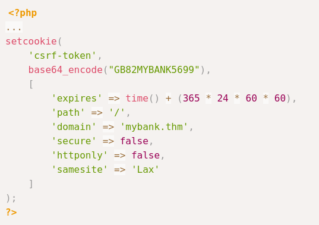

- Vulnerability where an attacker tricks a user's web browser into performing an unwanted action on trusted site where the user is authenticated.
- Achieved by exploiting the fact that the browser includes any relevant cookies automatically, allowing the attacker to forge and submit unauthorized requests on behalf of the user (through the browser).
- ### Phases
	- The attacker already knows the format of the web application's requests to carry out a particular task and sends a malicious link to the user.
	- The victim's identity on the website is verified, typically by cookies transmitted automatically with each domain request and clicks the link shared by the attacker. This interaction could be a click, mouse over, or any other action.
	- Insufficient security measures prevent the web application from distinguishing between authentic user requests and those that have been falsified.
- ### Risks
	- **Unauthorized Access**
		- Attackers can access and control a user's actions, putting them at risk of losing money, damaging their reputation, and facing legal consequences.
	- **Exploiting Trust**
		- CSRF exploits the trust websites put in their users.
	- **Stealthy Exploitation**
		- CSRF works quietly, using standard browser behavior without needing advanced malware. User's might be unaware of the attack.
- ### Types
	- ##### Traditional CSRF
		- Concentrate on state-changing actions carried out by submitting forms. The victim is tricked into submitting a form without realizing the associated data like cookies, URL parameters, etc.
		- The victim's web browser sends an HTTP request to a web application form where the victim has already been authenticated.
		- **Example**
			- The victim is already logged on to his bank website. The attacker create a crafted malicious link and email it to the victim.
			- The victim opens the email in the same browser.
			- Once clicked, the malicious link enables the auto-transfer of the amount from the victim's browser to the attacker's bank account.
	- ##### XMLHttpRequest CSRF (Asynchronous CSRF)
		- An asynchronous CSRF exploitation occurs when operations are initiated without a complete page request-response cycle.
		- This is typical of modern online apps that leverage asynchronous server communication (via XMLHttpRequest or the Fetch API) and JavaScript to produce more dynamic user interfaces.
		- These attacks use asynchronous calls instead of the more conventional form submissions.
		- **Example**
			- The victim opens a session saved in their browser's cookies and logs into the mail web application.
			- The attacker entices the victim to open a malicious web page with a script that can send queries to the mail web application.
			- To modify the user's email forwarding preferences, the malicious script on the attacker's page makes an AJAX call to `webapp.com/api/updateEmail` (using XMLHttpRequest or Fetch).
			- The mail web application session cookie is included with the AJAX request in the victim's browser.
			- After receiving the AJAX request, mail web application evaluates it and modifies the victim's settings if no CSRF defenses exist.
	- ##### Flash-based CSRF
		- Conducting a CSRF attack by taking advantage of flaws in Adobe Flash Player components.
		- Applications with features like interactive content, video streaming, and intricate animations have been made possible with Flash.
		- Official support for Adobe Flash Player stopped on December 2020.
		- A malicious Flash file (.swf) posted on the attacker's website would typically send unauthorized requests to other websites to carry out Flash-based CSRF attacks.
- ### CSRF Token
	- Unique, unpredictable value associated with a user's session, ensuring each request comes from a legitimate source.
- ### Techniques
	- ##### Hidden Link/Image Exploitation (Traditional)
		- A covert technique that involves an attacker inserting a `0x0` pixel image or a link into a web page that is nearly undetectable to the user.
		- Typically the `src` or `href` element of the image is set to a destination URL intended to act on the user's behalf without the user's awareness.
		- This technique preys on authenticated sessions and utilizes a social engineering approach when a user may inadvertently perform operations on a different website while still logged in.
		- **Securing the Breach**
			- From a Pentester/Red Teamer perspective, it is vital to pentest each request and response parameter of the form
			- From a secure coder perspective, it is important to ensure that each request submitted to the web server carries a **unique token** so that the server can identify if it is clicked through a valid source.
	- ##### Double Submit Cookie Bypass
		- A cookie value corresponds to a value in a hidden form field. When the server receives a request, it checks that the cookie value matches the form field value, providing an additional layer of verification.
		- **How it works**
			- **Token Generation** when a user logs in or initiates a session, the server generates a CSRF token. This token is sent to the user's browser both as a cookie and embedded in hidden form fields of web forms where actions are performed (like money transfers).
			- **User Action** suppose the user to transfer money, they fill out the transfer form on the website, which includes the hidden CSRF token.
			- **Form Submission** Upon submitting the form, two versions of the CSRF token are sent to the server: one in the cookie and the other as part of the form data.
			- **Server Validation** The server then checks if the CSRF token in the cookie matches the one sent in the form data, if they don't match the request is rejected.
		- **Vulnerable Scenarios**
			- **Session Cookie Hijacking (MITM)**
				- If the CSRF token is not appropriately isolated and safeguarded from the session, an attacker may also be able to access it by other means such as malware, network spying, etc.
			- **Subverting the Same-Origin Policy (Attacker Controlled Subdomain)**
				- An attacker can set up a situation where the browser's same-origin policy is broken. Browser vulnerabilities or deceiving the user into sending a request through an attacker-controlled subdomain with permissions to set cookies for its parent domain could be used.
			- **Exploiting XSS Vulnerabilities**
				- An attacker may be able to obtain the CSRF token from the cookie or the page itself if the web application is vulnerable to XSS. By creating a fraudulent requests with the double-submitted cookie CSRF token, the attacker can get around the defense once they have the CSRF token.
			- **Predicting/Interfering with Token Generation**
				- An attacker may be able to guess or modify the CSRF token if the tokens are not generated securely and are predictable or if they can tamper with the token generation process.
			- **Subdomain Cookie Injection**
				- Injecting cookies into a user's browser from a related subdomain is another potentially sophisticated technique that might be used. This could fool the server's CSRF protection system by appearing authentic to the main domain.
		- **Example**
			- The attacker wants to access the target's bank account.
			- Exploiting a vulnerability like CSRF requires a lot of code and functionality and understanding the website logic from the developer's point of view.
			- The attacker logged into his bank account and noticed the form for updating password is protected with a CSRF token.
			- From the developer tools, the attacker verified the cookies for `PHPSESSID` and `csrf-token`.
			- Typically the `PHPSESSID` is randomly generated by PHP engine itself, and not very easy to reverse-engineer, so the attacker copied the `csrf-token` value.
			- Using [Cyber Chef](https://gchq.github.io/CyberChef/) to try to decode the string.
			- He noticed its Base64 encoded and the original value is his bank account number.
			- The attacker then used social engineering to make the victim click on a link.
			- The attacker prepared an email citing a suspicious log in attempt to the target's email to make him change his password.
			- The email contained a link to the attacker domain with a password update form similar to the original bank's one. The form has a CSRF token already set as a hidden parameter, as well as preconfigured values for the password.
			- The attacker sets a cookie as well so that the request is sent to the main domain.
			- 
		- **Securing the Breach**
			- From a Pentester/Red Teamer perspective, it is essential to validate the complete flow of HTTP request/response, double check the request parameters for any possible vulnerability like easy-to-guess tokens and invalid input, and examine the client-side JavaScript code for potential issues.
			- From a secure coder perspective, ensuring that the token generation methods generate extremely unique and hard-to-guess tokens.
	- ##### SameSite Cookie Bypass
		- **SameSite Cookie**
			- A cookie that comes with a special attribute designed to control when they are sent along with cross-site requests.
			- Implementing the SameSite cookie property is a reliable safeguard against cross-origin data leaks, CSRF, and XSS attacks.
			- Depending on the request's context, it tells the browser when to send the cookie. Strict, Lax, and None are the three potential values for the attribute.
			- **Strict**
				- Guarantees that the cookie is only sent if the request comes from the same origin as the cookie.
				- Offers the highest level of protection.
			- **Lax**
				- Specific cross-site usage is permitted by lax, such as top-level navigations, which are less likely to raise red flags. None of them need the secure attribute, and all requests made by websites that belong to third parties will send cookies.
				- They allow cookies to be sent with HTTP methods like GET, HEAD, and OPTIONS. This means that it won't be sent with cross-origin POST requests.
			- **None**
				- Makes the cookie accessible across different origins, but to prevent potential security risks associated with cross-site requests, None SameSite cookies require the Secure attribute if the request is made over HTTPS. This ensures that cookies are only sent over secure connections, reducing the likelihood of interception or tampering by malicious actors during transit.
		- **Exploiting Lax**
			- After the attacker gaining access to the target's bank account, the attacker wants to log him out of his account.
			- A logout cookie that is set once he logs in, and the cookie is set as Lax.
			- The attacker sends another email to the target with a link to force him to logout.
			- **Lax with POST Scenario**
				- Chrome's default action if the `SameSite` attribute is not specified for a cookie is to treat it as `SameSite=Lax`.
				- But Chrome makes an exception for cookies set without a `SameSite` attribute less than 2 minutes ago. Such cookies will be sent with non-idempotent (e.g. POST) top-level cross-site requests despite normal `SameSite=Lax` cookies requiring top-level cross-site requests to have a safe HTTP method.
				- So if the server reads or modifies a cookie that doesn't have a SameSite attribute set, the cookie will be sent in the cross-site request till 2 minutes just like `SameSite=None`. After 2 minutes it will be treated as Lax.
	- ##### XMLHttpRequest Exploitation
		- CSRF attacks can succeed even when AJAX requests are subject to the Same-Origin Policy, which typically forbids cross-origin requests.
		- **Same-Origin Policy and Cross-Origin Resource Sharing (CORS) Bypass**
			- Under an appropriate CORS policy, certain requests could only be submitted by recognizing origins. However, misconfigurations in CORS policies can allow attackers to circumvent these limitations if they rely on origins that the attacker can control or if credentials are included in cross-origin requests.
			- The use of `Access-Control-Allow-Origin:*` allowing requests from any origin, makes it vulnerable to CSRF.
			- There are scenarios where allowing requests from different origins is necessary and legitimate, such as in public APIs or content distribution networks. However, it's crucial to carefully consider the security implications and ensure that **Access-Control-Allow-Credentials** is set accordingly to forward credentials only to trusted origins.
			- **Access-Control-Allow-Origin: *** and **Access-Control-Allow-Credentials:true** cannot be used together due to security restrictions imposed by the CORS specification.
		- **Referer Header Bypass**
			- When making an HTTP request, the referer header contains the URL of the last page the user visited before making the current request.
			- Some websites guard against CSRF by only allowing queries if the referer header matches their domain. The utility of this as a stand-alone CSRF protection solution is reduced when this header may be changed or eliminated, as happens with user-installed browser extensions, privacy tools, or meta tags that instruct the browser to omit the referer.
- ### Defense Mechanisms
	- ##### Pentesters/Red Teamers
		- **CSRF Testing**
			- Actively testing applications for CSRF vulnerabilities by attempting to execute unauthorized actions through manipulated requests and assess the effectiveness of implemented protections.
		- **Boundary Validation** 
			- Evaluate the application's validation mechanisms, ensuring that user inputs are appropriately validated and anti-CSRF tokens are present and correctly verifies to prevent request forgery.
		- **Security Headers Analysis**
			- Assess the presence and effectiveness of security headers, such as CORS and Referer, to enhance the overall security and prevent various attack vectors, including CSRF.
		- **Session Management Testing**
			- Examine the application's session management mechanisms, ensuring that session tokens are securely generated, transmitted, and validated to prevent unauthorized access and actions.
		- **CSRF Exploitation Scenarios**
			- Explore various CSRF exploitation scenarios, such as embedding malicious requests in image tags or exploiting trusted endpoints, to identify potential weaknesses in the application's defenses and improve security measures.
	- ##### Secure Coders
		- **Anti-CSRF Tokens
			- Integrate anti-CSRF tokens into each form or request to ensure that only requests with valid and unpredictable tokens are accepted, thwarting CSRF attacks.
		- ##### SameSite Cookie Attribute
			- Set the SameSite attribute on cookies to `Strict` or `Lax` to control when cookies are sent with cross-site requests, minimizing the risk of CSRF by restricting cookie behavior.
		- **Referer Policy**
			- Implement a strict referrer, limiting the information disclosed in the referer header and ensuring that requests come from trusted sources, thereby preventing unauthorized cross-site requests.
		- **Content Security Policy**
			- Utilize the CSP to define and enforce a policy that specifies the trusted sources of content, mitigating the risk of injecting malicious scripts into web pages.
		- **Double-Submit Cookie Pattern
			- Implement a secure double-submit cookie pattern, where an anti-CSRF token is stored both in a cookie and as a request parameter. The server then compares both values to authenticate requests.
		- **Implement CAPTCHAS**
			- Secure developers can incorporate CAPTCHA challenges as an additional layer of defense against CSRF attacks especially in user authentication, form submissions, and account creation processes.
