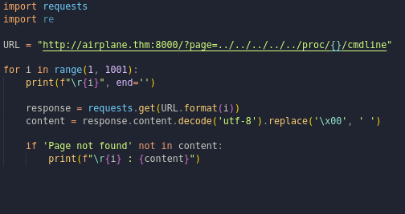

- An LFI vulnerability allows the attacker to include and read local files on the server, which could contain sensitive data.
- Occurs due to a developer's lack of security awareness, and lack of user input validation/sanitization.
- ## Risk
	- Sensitive data leakage.
	- LFI could be chained to perform Remote Code Execution (RCE) on the server.
- ## Identifying and Testing for LFI
	- HTTP parameters are used to manipulate parameters and inject attack payloads.
	- An HTTP GET/POST parameters that pass an argument or data to the web application to perform a specific operation.
	- After the entry point is found &uarr; we need to understand how this data could be processed within the application.
	- The following PHP functions could cause this kind of vulnerability
		- `include`
		- `require`
		- `include_once`
		- `require_once`
	- **Steps**
		- Find an entry point that could be via GET, POST, COOKIE, or HTTP header values.
		- Enter a valid input to see how the web server behaves.
		- Enter invalid inputs, including special characters and common file names.
		- Don't always trust what you supply in input forms is what you intended! Use either a browser address bar or a tool such as Burpsuite.
		- Look for errors while entering invalid input to disclose the current path of the web application; if there are no errors, then trial and error might be your best option.
		- Understand the input validation and if there are any filters.
		- Try the inject a valid entry to read sensitive files
- Files that are useful to read after finding the vulnerability
	- `/etc/issue`
	- `/etc/passwd`
	- `/etc/shadow`
	- `/etc/group`
	- `/etc/hosts`
	- `/etc/motd`
	- `/etc/mysql/my.cnf`
	- `/proc/[0-9]*/fd/[0-9]* ` (first number is the PID, second is the file descriptor)
	- `/proc/self/environ`
	- `/proc/version`
	- `/proc/cmdline`
- ## Techniques
	- Direct File Inclusion, like `?file=/etc/passwd`.
	- Using `..` to get out of the current directory and traverse the other directories for data, like `?file=../../../../../../../etc/passwd`.
	- Adding a Null character like `?file=../../../../../../etc/passwd%00`.
	- Bypassing filter using `....//` like `?file=....//....//....//etc/passwd`.
	- Bypassing keyword filter using `?file=../../../../etc/passwd/.`.
	- URL encoding techniques like double encoding `?file=%252e%252e%252fetc%252fpasswd`.
	- Depending on the web application type, some wrappers can be used like PHP Filter and PHP DATA, like `?file=php://filter/resource=/etc/passwd`.
	- **PHP Filter**
		- To read PHP files using the above technique, some encoding could be required first using `base64` or `ROT13`, like `?file=php://filter/read=string.rot13/resource=/etc/passwd` and `?file=php://filter/convert.base64-encode/resource=/etc/passwd`, and afterwards decode the leaked data.
	- **PHP DATA**
		- Used to include raw plain text or `base64` encoded data. It is used to include images on the current page.
		- Encode the data using `echo <data> | base64` then use the encoded data inside the parameter `?file=data://text/plain;base64,<data>`.
		- Using this technique, we can encode PHP code and include it into PHP data wrapper.
- ## Steps
	- After checking for the vulnerability, check `/proc/self/environ`.
	- Check `/proc/self/cmdline`.
	- From the output of the above, get the application file.
	- Get the open ports using `/proc/net/tcp`.
	- Fuzz the processes using a script `/proc/<value>/cmdline`, depending on the output from the above finding, we might not need to convert into hex like in the script. 
- ## Using LFI to Get RCE
	- Include malicious payload into services log files such as Apache, SSH, etc. Then the LFI vulnerability is used to request the page that includes payload.
	- It depends on various factors such as the design of web application and server configurations.
	- Requires enumeration, analysis, and an understanding of how the web application work.
	- #### Using User-Agent
		- Since `User-Agent` header is controllable by the user, include the malicious payload into the `User-Agent` header
		- Test if we can include `User-Agent` value into the web application log file using `curl -A "Testing" <url>`.
		- Inject PHP code into the `User-Agent` using the browser, terminal, or burp. `curl -A "<?php phpinfo();?>" <url>`
		- View the log page.
		- Send a request to the log file using LFI to execute in the browser.
	- #### Using PHP Sessions
		- Requires enumeration to read the PHP configuration file first, and then we know where the PHP sessions files are. Then, we include a PHP code into the session and finally call the file via LFI. PHP stores session data in files within the system in different locations based on the configuration.
		- Common locations that PHP stores sessions in:
			- `c:\Windows\Temp`
			- `/tmp/`
			- `/var/lib/php5`
			- `/var/lib/php/session`
		- Inject PHP code through input, which will be stored in a session file (Schema `sess_<SESSION_ID>` which is saved in cookies). Using LFI to call the session file which is stored in one of the above locations.
