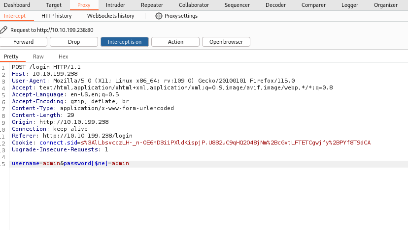
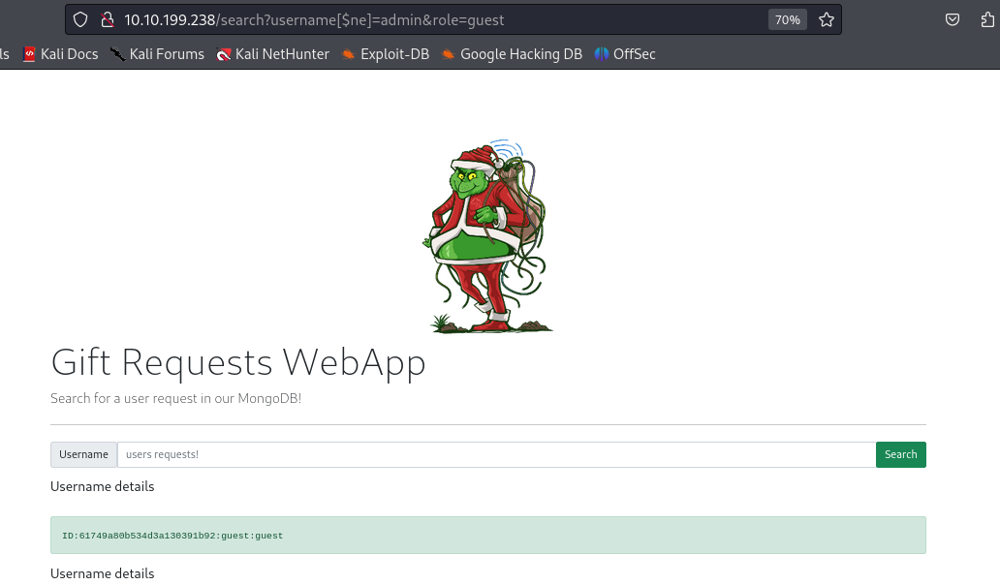

- A NoSQL database refers to a non-relational database.
- Used nowadays for big Data and IoT devices due to their powerful features such as fast queries, ease of use to developers, scale easily, and flexible data structure.
- **Types:** MongoDB, Couchbase, RavenDB, etc..
- ## Components
	- **Collections:** Similar to tables or views in MySQL and MSSQL.
	- **Documents:** Similar to rows or records in MySQL and MSSQL.
	- **Fields:** Similar to columns in MySQL and MSSQL.
	- **Documents** are in MongoDB are objects stored in a format called `BSON`, which supports `JSON` data types for document storing.
 - ## Operators
	 - `$and` -> `AND`
	 - `$or` -> `OR`
	 - `$eq` -> `=`
	 - `$ne` -> `!=`
	 - `$gt` -> `>`
	 - `$lt` -> `<`
	 - `$where` matches records based on JavaScript condition
	 - `$exists` matches records that have a certain field
	 - `$regex` matches records that satisfy certain regular expression
 - ## Types
	- #### Syntax Injection
		- This is similar to SQL injection, where we have the ability to break out of the query and inject our own payload.
		- The key difference to SQL injection is the syntax used to perform the injection attack.
	- #### Operator Injection
		- Even if we can't break out of the query, we could potentially inject a NoSQL query operator that manipulates the query's behavior, allowing us to stage attacks such as authentication bypasses.
		- The syntax for a login bypass
			- The login page sends a POST Request with the `user` and `password` parameters.
			- The parameters should be `['username' = ['$ne'=>'xxxx'], 'password'=>['$ne'=>'yyyy']]`.
			- This would return any document where the username isn't equal to `xxxx` and the password not equal to `yyyy`.
			- To pass an array as part of a POST HTTP Request, use this POST Request Body notation: `user[$ne]=xxxx&pass[$ne]=yyyy`.
- ## Syntax
	- Connect to MongoDB using `mongo`.
	- Use `show databases` to list the available databases.
	- Connect/Create a database using `use <dbname>`.
	- Create collections using `db.createCollection("<collection_name>")` function.
	- Show collections using `db.getCollectionNames()` function.
	- Create a document within a collection called `users` using `db.users.insert({id:"1", username:"admin", email:"admin@admin.com", password:"password123"})`.
	- List documents within a collection using `db.users.find()`.
	- Update a document with `id=2` using `db.users.update({id:"2"}, {$set: {username:"tryhackme"}})`.
	- Remove a document using `db.users.remove({'id':'2'})`.
	- Drop a collection using `db.users.drop()`.
- ## NoSQL Injection
	- Bypassing NoSQL filters may look impossible to do since they rely on creating a structured array. Unlike SQL queries, NoSQL queries require nested associative arrays. From an attacker's point of view, this means that to inject NoSQL, one must be able to inject arrays into the application.
	- Many server-side programming languages allow passing array variables by using a special syntax on the query string of an HTTP Request.
	- #### Bypassing login pages
		- Usually, web applications use `db.users.find({query})` or `db.users.findOne(query)` functions where the `query` is `JSON` data that's sent via the application `{"username":"admin", "password":"password123"}`.
		- When correct credentials are provided, a document is returned, while a `null` reply is received when providing the wrong credentials or when nothing matches.
		- `db.users.findOne({username:"admin", password: {"$ne":"xyz"}})`
			- This is searching for a user with the username `admin` and his password not equals to `xyz` which is almost always true.
		- Login in as a user that is not `admin` using `db.users.findOne({username:{"$ne":"admin"}, password:{"$ne":"xyz"}})`.
		- Using Burp Suite to capture the login request and change the passed parameters to. 
	- #### Exploiting NoSQL Injection
		- Find an entry point that doesn't sanitize the user input correctly.
		- Understand how the web application passes the request to the database. Sometimes the web apps accept the user's input via `GET` or `POST` queries, and sometimes they accept a `JSON` object, as is the case with APIs.
		- **For GET and POST queries**
			- Injecting an array of the MongoDB operator to match the `JSON` object to match the `key:value`. `http://example.com/search?username=admin&role[$ne]=user`
			- `http://example.com/search?username=[$ne]=ben&role=user` gets all the users with role user.
			- 
			- 