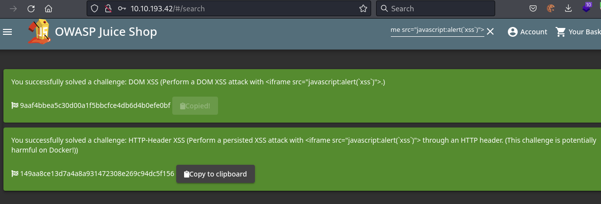

## *Enumeration*
>	 - Exploring around on the website, the admin's email can be found in some of the reviews on the products.
>	 - Trying a random search to see the parameter.
>	 - Going to the Green Smoothie product and viewing Jim's review.
>	 - Doing a basic google search for `replicator` shows the TV show.
## *SQL Injection*
>	- Injecting basic SQL to the login page to access the admin's account.
>	- Using `bender@juice-sh.op'--` as the email to access the account.
## *Broken Authentication*
>	- Using Burp suite's Intruder to do a brute-force attack to get the admin's password using `/seclists/Passwords/Common-Credentials/best1050.txt` word list.
>	- The admin password is `admin123`.
>	- Resetting Jim's password, getting his security question's answer by doing another google search for `Jim star trek siblings`.
## *Sensitive Data Exposure*
>	- Accessing the About page, a link to an FTP directory is revealed.
>	- Downloading the `acquisitions.md` file, confidential data is exposed.
>	- From the video, the "rapper" exposes his password as `Mr. Noodles` but replaces the Os with 0s, logging in with `mc.safesearch@juice-sh.op:Mr. N00dles`.
>	- Going back to the FTP directory and trying to download the backup file.
>	- Using the Poison Null Byte technique to bypass the type control. Adding the URL encoded `%00` to the end of the file which would look like `/ftp/package.json.bak%2500.md`.
>	- Poison Null Byte is a Null terminator string that will tell the server to terminate at that point, nulling the rest of the string.
## *Broken Access Control*
>	- Opening the developer tools and looking at the debugger for the JS file. Searching for the admin keyword in the file.
>	- Going to the path `/#/administration`.
>	- Using Burp suite to capture the request to get the basket and changing the user id.
>	- Viewing the basket.
>	- Delete the 5 star review to get the flag.
## *Cross-site Scripting*
>	- Using the `iframe` element in the search bar to trigger an alert with JavaScript.
>	- With Burp suite on, log out from the account, edit the caught request and add a new header to the header section with name `True-Client-IP` and value `<iframe src="javascript:alert('xss')">`.
>	- Forwarding the request to view the flag.
>	- Going to the order history page and clicking on the truck icon to track an order. The URL has an ID, editing it to have the value of `<iframe src="javascript:alert('xss')">`.