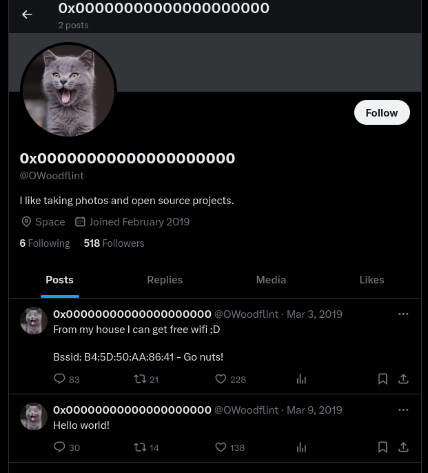

## *OSINT*
>	- Using `exiftool` to extract metadata from the image.
>	- Using the ID found in the Copyright element in the `whatsmyname` tool to view the accounts in common web applications.
>	- Checking the twitter/X account to view the profile picture.
>	- Using the BSSID found in a post to get the location from `wigle.net`.
>	- Zoom in all the way to get the SSID.
>	- Doing a quick google search on the ID again, a GitHub account can be found, going to the only repository, information can be found.
>	- Accessing the WordPress website.
>	- Inspecting the page, a white colored `p` tag is found containing the password.