## *Enumeration*
>	- Username found when inspecting the website `R1ckRul3s`.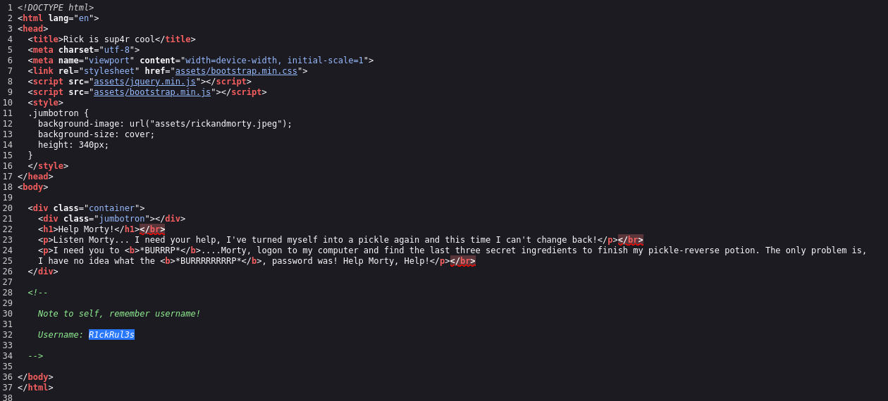
>	- Using `nmap` to scan for open ports, then taking these open ports to perform further scanning on vulnerabilities and services.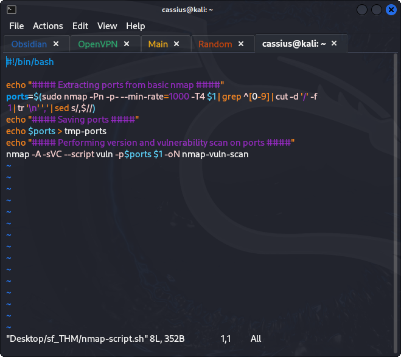
>	- From the above scan a `/login.php` page is found.
>	- Performing a basic directory search with `gobuster`, a `robots.txt` file is found which contained a password `Wubbalubbadubdub`.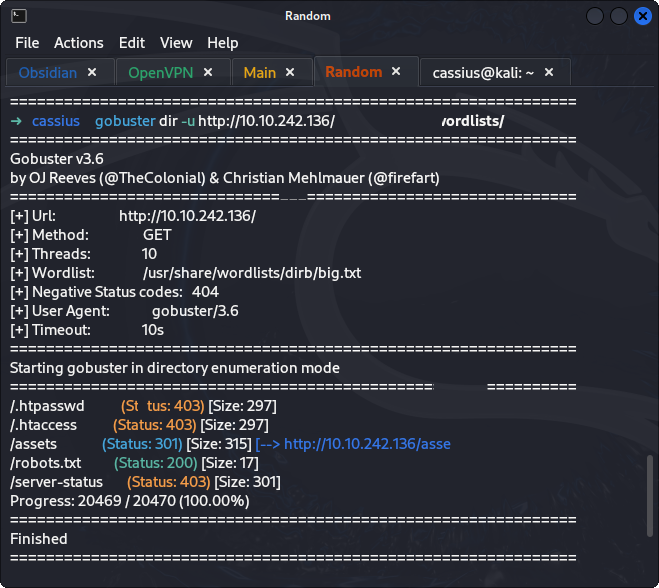
>	- Using the found username and password to access the admin page.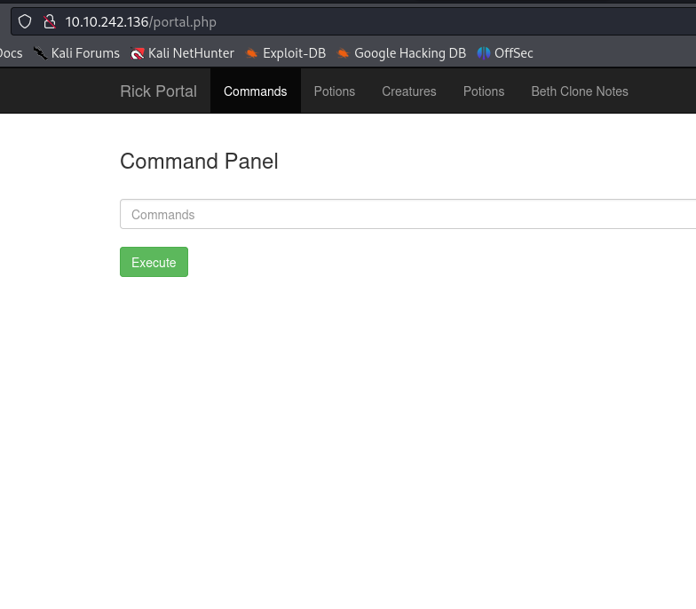
>	- Using `ls` to view the content of the working directory.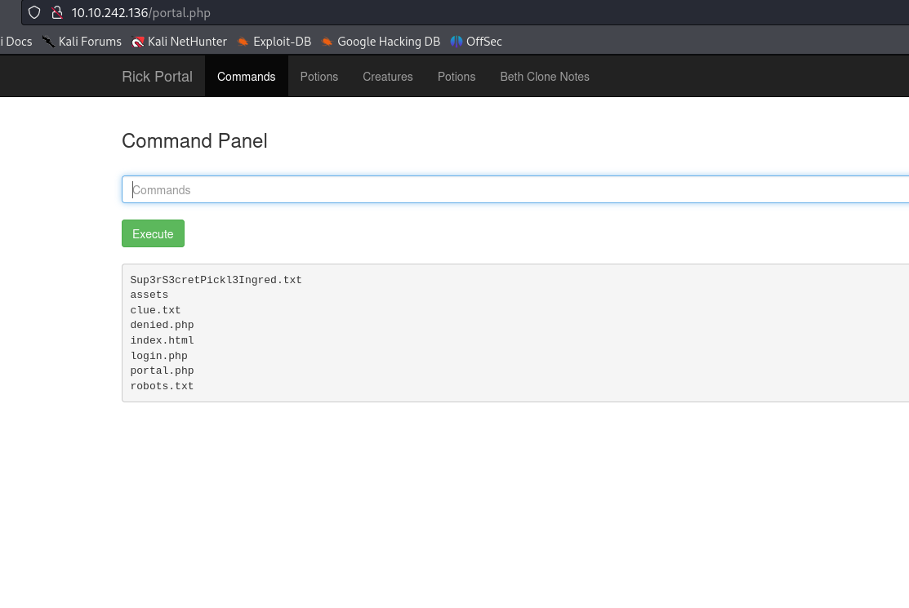
>	- `cat`ing is disabled, viewing the `Sup3rS3cretPickl3Ingred.txt` file to get the first ingredient.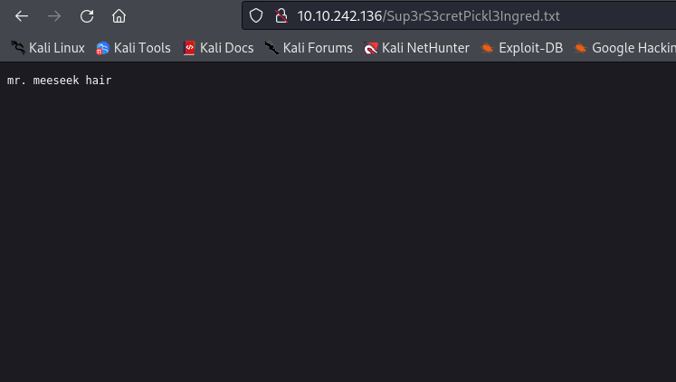
>	- Continue with the file enumeration, down till the `home` directory using `ls ../../../home/rick/` the second ingredient can be found.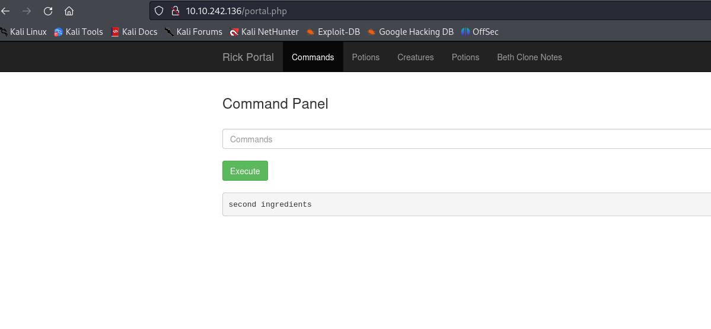
>	- Using `tac ../../../home/rick/second\ ingredients` to get the content of the file.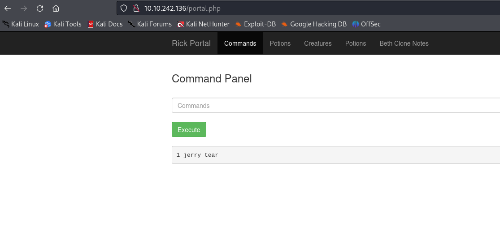
>	- Checking the `portal.php` file, a list of disabled commands can be found.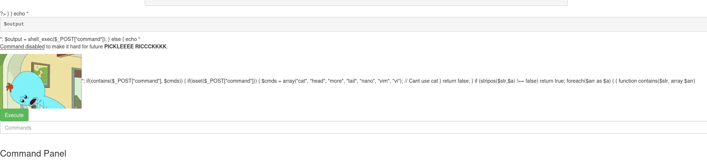
>	- `sudo` can be used, so we can check the `root` directory with it.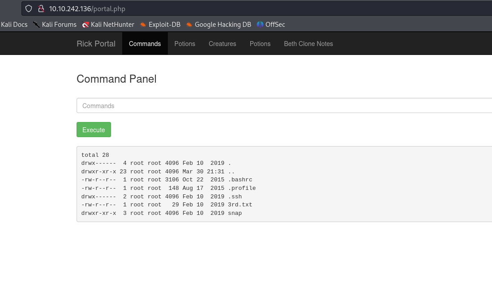
>	- Using `sudo tac ../../../root/3rd.txt` to view the third ingredient.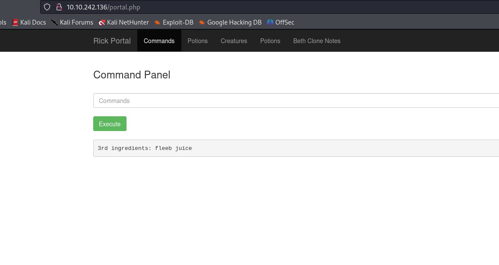