## **Enumeration**
>	- Running Nmap script to get open ports and scan for services and their vulnerabilities. 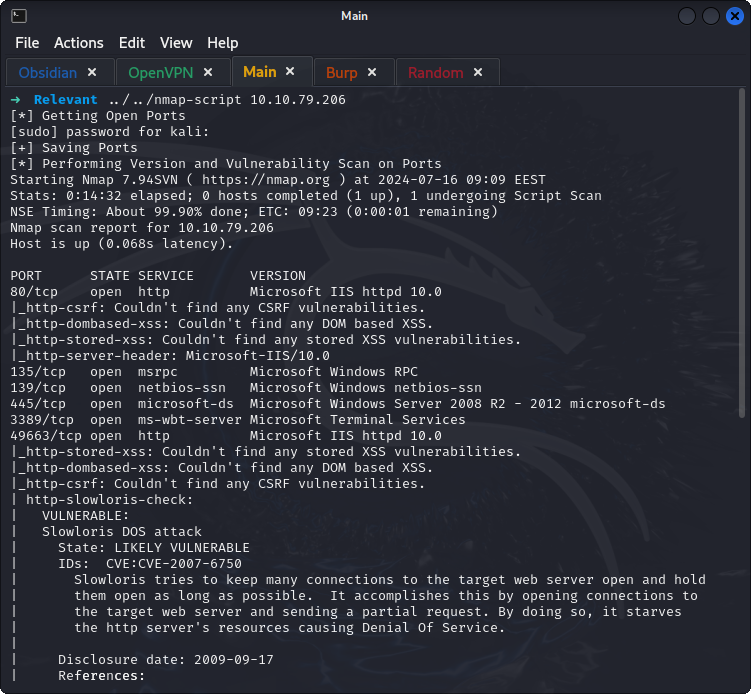 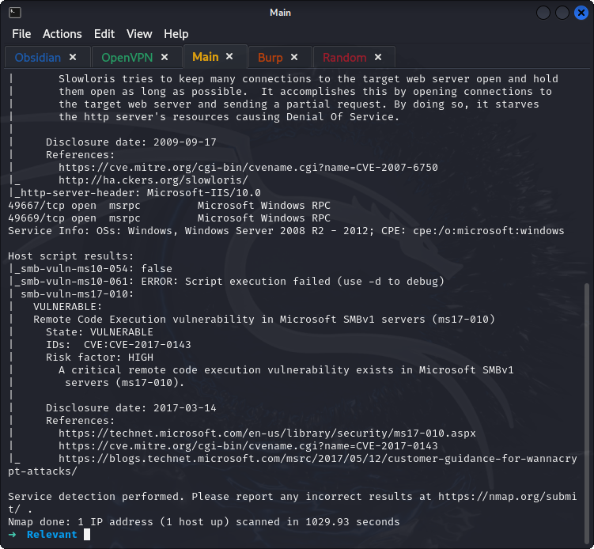
>	- Directory enumeration with `gobuster` didn't show any promising output. 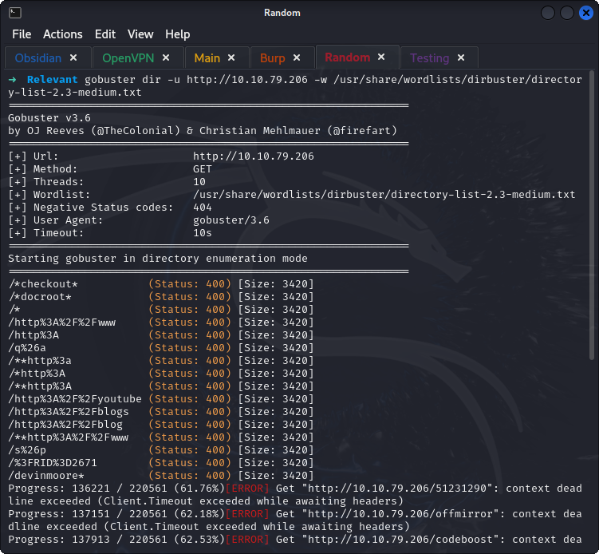
>	- Used `smbclient -N -L \\<ip>` to view shares. 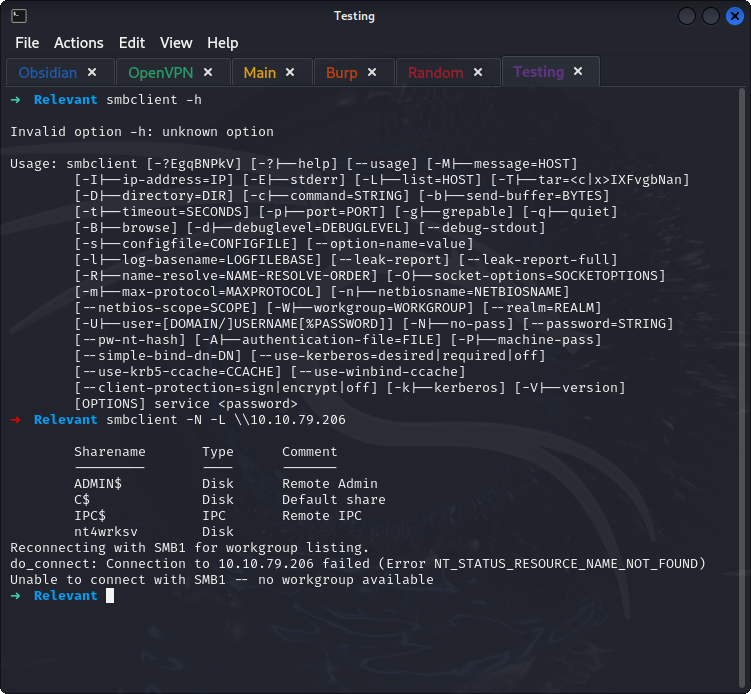
>	- Connecting to the `nt4wrksv` share using `smbclient \\\\10.10.82.106\\nt4wrksv`. 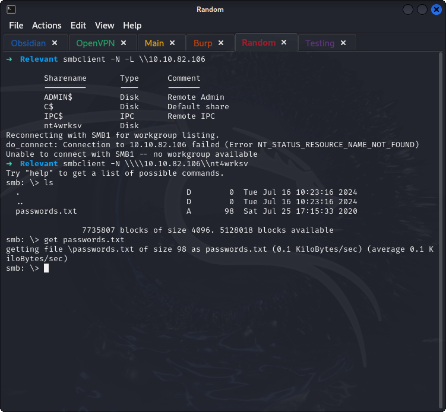
>	- The content of the passwords file is encoded. 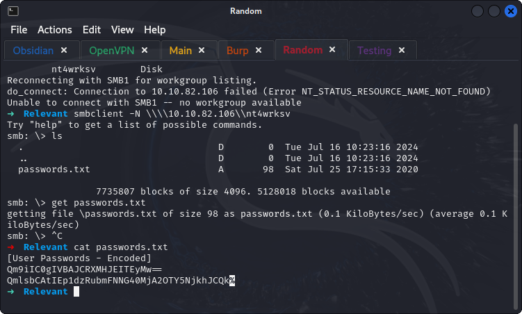
>	- Using CyberChef to decode the passwords. 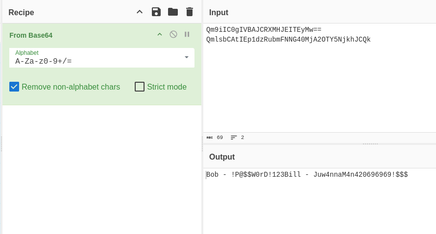

### **NOTE**: The machine keeps becoming unreachable, had to terminate it a couple of times.
## **Exploitation**
>	- From the previous Nmap, the machine is vulnerable to a variation of Eternal Blue (CVE-2017-0143).
>	- Creating a reverse shell using `msfvenom`. 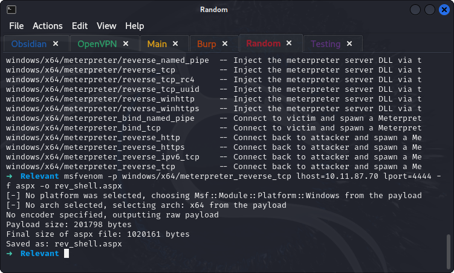
>	- Upload that shell using `smbclient`.
>	- Using metasploit's `multi/handler` to wait for the reverse shell. 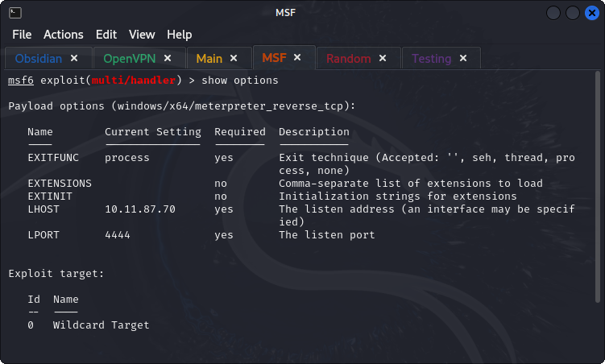
>	- Running the listener and then triggering the shell using `curl http://10.10.84.139:49663/nt4wrksv/rev_shell.aspx`. 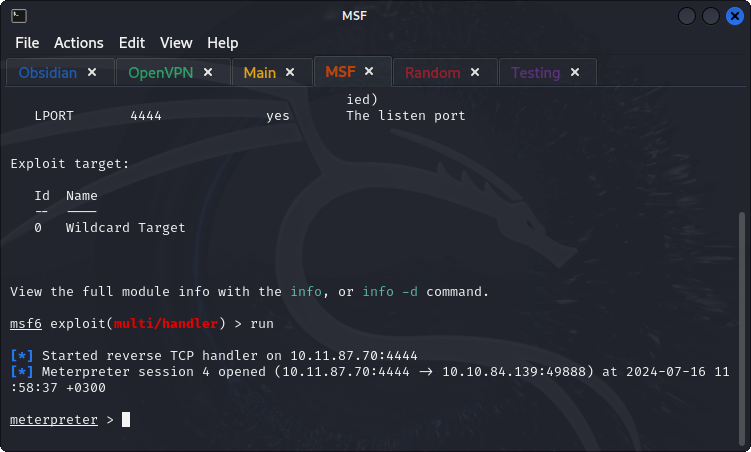
>	- Searching for the user.txt file. 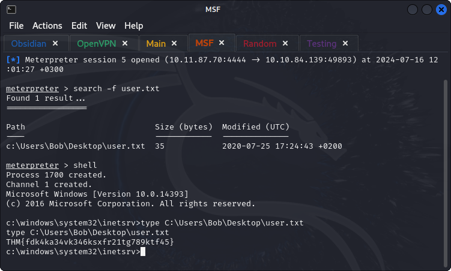

## **Privilege Escalation**
>	- Using `getsystem` functionality of meterpreter was able to escalate privileges using Named Pipe Impersonation. 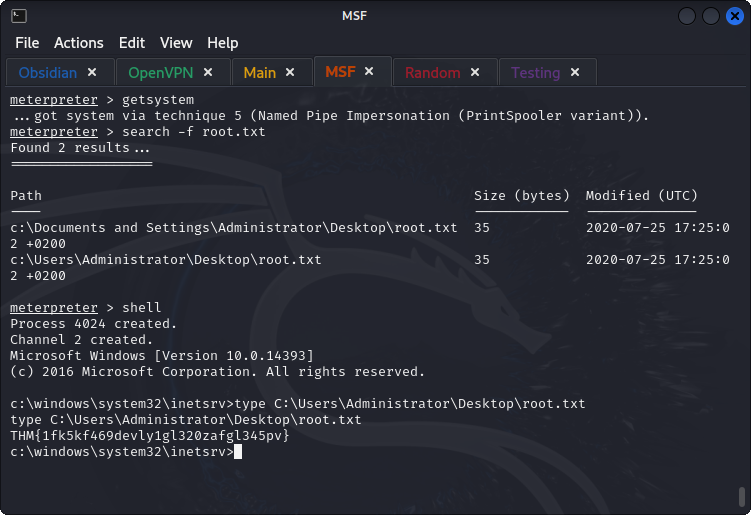
>	- Documentation &rarr; [Rapid7's Github](https://github.com/rapid7/metasploit-framework/blob/master/documentation/modules/post/windows/escalate/getsystem.md#5---named-pipe-impersonation-print-spooler-variant) and [Red Team Notes](https://www.ired.team/offensive-security/privilege-escalation/windows-namedpipes-privilege-escalation)